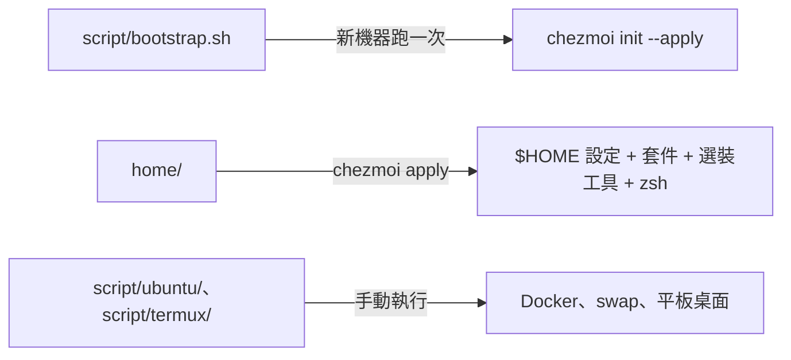

# dotfiles

個人公開設定，以 **Ubuntu + 純 zsh** 為主；日常用在 WSL2，也用在雲端主機與 Android 平板
（原生 Termux、Termux 裡的 proot Ubuntu）。

## 支援哪些環境

| 機器 | 怎麼判斷 | chezmoi 會做什麼 |
|---|---|---|
| WSL2 Ubuntu | kernel 版本含 `microsoft` | 基底套件、zsh、選裝工具選單（不列 headless Chrome） |
| 雲端主機、proot Ubuntu | 其他 Linux | 同上；amd64 才列 headless Chrome |
| 原生 Termux | `chezmoi.os` 是 `android` | 基底套件、zsh、終端機字型；**沒有**選單（開發環境放 proot Ubuntu） |

機器種類自動判斷，不用回答。Windows 那一側（`wsl/`）是手動套用的參考檔。

## 這個 repo 怎麼分工



- **chezmoi 管家目錄和套件**：設定檔、基底套件、選裝工具、p10k 與 zsh 插件、預設 shell 都由
  `chezmoi apply` 處理。
- **手動腳本只剩會改系統的東西**：`script/ubuntu/install-docker.sh`（會移除衝突套件）、
  `script/ubuntu/setup-swap.sh`（改 `/etc/fstab`）、`script/termux/` 的平板桌面。
- 其餘 chezmoi 看不到：`docs/`（說明）、`wsl/`（Windows 端）、`ai-agent/`（手動貼用的 persona）。

預設 source repo 在 `~/.local/share/chezmoi`。

### `home/` 部署到哪

| repo | 部署到 | 內容 |
|---|---|---|
| `home/dot_zshrc`、`dot_p10k.zsh`、`dot_gitconfig.tmpl` | `~/.zshrc`、`~/.p10k.zsh`、`~/.gitconfig` | shell、p10k 設定、git |
| `home/.chezmoiexternal.toml.tmpl` | `~/.config/zsh/*`、Termux 的 `~/.termux/font.ttf` | p10k、zsh 插件、Termux 字型（apply 時下載） |
| `home/.chezmoidata/packages.yaml` | （不部署） | 基底套件與走 apt 的選裝工具清單 |
| `home/run_*` | （不部署，apply 時執行） | 裝套件、裝選裝工具、換預設 shell |
| `home/dot_config/*` | `~/.config/*` | nvim、git hooks、zsh、code-server、opencode、skillshare 的 `config.yaml` |
| `home/dot_claude/`、`dot_codex/` | `~/.claude/`、`~/.codex/` | Claude Code、Codex 的規則與設定（不含 skills、MCP） |
| `home/dot_local/bin/` | `~/.local/bin/` | 自己的指令（`ai-profile`、`chrome-mcp`、`share-shell` 等） |
| `home/private_dot_ssh/` | `~/.ssh/`（700） | SSH config |
| `home/.chezmoi.toml.tmpl` | `~/.config/chezmoi/chezmoi.toml` | 憑證、Git 身分、選裝工具的選擇（`chezmoi init` 時問） |

逐檔清單跑 `chezmoi managed`。skills 和 MCP 不在這裡，見 agent-config 的
[skill](https://github.com/henry5720/agent-config/blob/main/docs/skills/README.md)、[MCP](https://github.com/henry5720/agent-config/blob/main/docs/mcp.md)。

chezmoi 會依命名與 template 規則部署 `home/`，不一定原樣複製。用法與檔名前綴請看
[chezmoi 官方文件](https://www.chezmoi.io/)及 [target types](https://www.chezmoi.io/reference/target-types/)。

## 使用前

- fork 或使用前，先檢查 provider、agent rules、SSH、Windows/Termux 機器設定。bootstrap 與
  ssh config 都寫死 `henry5720` 帳號和 `~/.ssh/henry5720` 這把 key，fork 要一起改。
- 已有設定的機器先備份；不要未檢查就部署別人的個人 dotfiles。
- Ubuntu 機器要能 `sudo`：裝套件、換 shell 都會叫 sudo。沒有 sudo 的機器不支援。
- 憑證不進 git；`chezmoi init` 只在尚未有值時提示，值放在
  `~/.config/chezmoi/chezmoi.toml`。不信任或共用機器不要填真實憑證。

## 新機器

先做腳本做不到的前置，再跑同一行 bootstrap：

| 機器 | 前置（手動） |
|---|---|
| WSL2 | Windows 裝好 WSL Ubuntu；終端機字型裝在 Windows 那側，見 [wsl/command.md](wsl/command.md#終端機字型hack-nerd-font) |
| 雲端主機 | 能 SSH 進去、帳號能 sudo |
| 原生 Termux | 從 **F-Droid** 裝 Termux；要桌面再從 GitHub 裝 Termux:X11 app（見[新機器設定](docs/new-machine-setup.md#平板原生-termux-與-proot-ubuntu)） |
| proot Ubuntu | 先在原生 Termux 跑完 bootstrap，再跑 `script/termux/setup-proot-ubuntu.sh` 建使用者並登入 |

```bash
bash <(curl -fsSL https://raw.githubusercontent.com/henry5720/dotfiles/main/script/bootstrap.sh)
```

要用 `bash <(...)`，不要 `curl | bash`：wizard 要從終端機讀你貼上的 SSH key。它依序做系統更新、
裝 git／ssh／curl、放 `~/.ssh/henry5720`、驗證 GitHub、裝 chezmoi，最後
`chezmoi init --apply`。每一關都能重跑。逐步說明、平板流程、裝完之後的 AI 工具設定見
[新機器設定](docs/new-machine-setup.md)。

## 之後想加減工具

Ubuntu 機器第一次 `chezmoi init` 會出一個勾選選單，**預設全選**，直接 Enter 就全部裝。之後
的 `chezmoi apply` 不再問。要改選擇，直接改存下來的設定：

```bash
chezmoi edit-config   # 改 [data] 底下的 tools = [...] 那一行
chezmoi apply         # 新勾的工具這時才裝
```

- **取消勾選不會解除安裝**，只是之後不再管它；要移除自己手動移。
- 可選的名稱就是 `home/.chezmoi.toml.tmpl` 裡 `$toolChoices` 列的那些。**選單以後加了新工具，
  舊機器不會自動問**，一樣用 `edit-config` 加進去。
- ⚠️ 也可以 `chezmoi init --prompt` 重出選單，但它會把**所有**問題重問一遍。選單與 Git 身分的
  預設是現在存的值，直接 Enter 會保留；**憑證的預設是空的**（刻意不帶現值，免得明文印在
  提示上），直接 Enter 會把憑證清空。用之前先準備好要重填的值。
- 已經裝過的工具不會重裝；chezmoi 也不負責更新選裝工具。

## 既有機器升級到這個流程

以前用 `script/ubuntu/` 舊安裝腳本裝的機器，拉新版之後：

1. `chezmoi diff` 會多出兩支腳本：裝基底套件（不缺就直接結束）、換預設 shell（已經是
   zsh 就直接結束）。p10k、zsh 插件目錄已經存在，chezmoi 直接接手，不會重新 clone。
   另外 `~/.p10k.zsh` 會被 repo 那份**覆蓋**：以前自己跑 `p10k configure` 產的那份如果跟
   repo 不一樣，diff 會列出來，apply 前要留的先備份（內容相同就沒有 diff）。
2. chezmoi 會提示 `config file template has changed`。跑 `chezmoi init` 時會出選裝工具選單，
   **預設全選，直接 Enter 會裝原本沒裝的工具**（例如 AI 文件解析的 venv，好幾 GB）。先取消
   不要的再 Enter。

## 日常修改

```text
修改 home/ → chezmoi diff → 確認 → chezmoi apply → chezmoi verify
```

```bash
cd ~/.local/share/chezmoi
# 修改 home/ 裡的檔案
chezmoi diff
chezmoi apply
chezmoi verify
```

不要直接改已部署的 `$HOME` 檔案；本機有不認得的變更時，先備份或處理衝突。

## 文件索引

- [新機器設定](docs/new-machine-setup.md)：bootstrap 每一關、平板與 proot、裝完之後的 AI agent 與各 repo 設定。
- [AI agent setup](docs/ai-agent-setup.md)：規則、plugin、codegraph 與 opencode；skill 與 MCP 指到 agent-config。
- [AI profile routing](docs/ai-profile-routing.md)：公司／個人 CLI 的切換與登入前置。
- [chrome-mcp](https://github.com/henry5720/agent-config/blob/main/docs/skills/chrome-mcp.md)（在 agent-config）：瀏覽器 MCP、轉發到 EC2 與排錯。
- [code-server remote](docs/code-server-remote.md)：自己從其他裝置連線 code-server。
- [開給訪客看](docs/share-with-guest.md)：用 tailscale funnel 把 shell（`share-shell`）或 dev server 臨時開給沒有 tailscale 的人。
- [Herdr notifications](docs/herdr-notifications.md)：WSL2 通知音與 PulseAudio 排錯。
- [WSL 常用指令](wsl/command.md)：Windows 終端機字型、port 轉發。

repo 修改規範與驗證方式（含容器 e2e 測試）見 [`CLAUDE.md`](CLAUDE.md)。`docs/superpowers/`
是歷史 spec/plan，不是現行文件。
