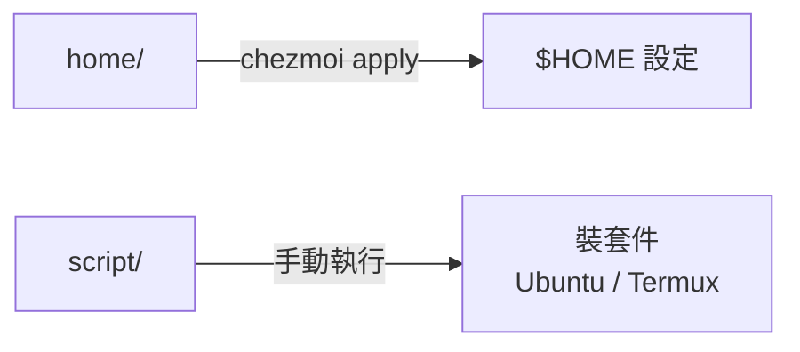

# dotfiles

個人公開設定，以 **Ubuntu + 純 zsh** 為主；日常用在 WSL2，也用在雲端主機。

## 支援哪些環境

| 部分 | 能用在 | 說明 |
|---|---|---|
| `home/`（chezmoi 部署） | 一般 Linux | WSL 專屬的設定（Windows 字型）不在 WSL 時自動略過 |
| `script/ubuntu/` | Ubuntu／Debian 系 | 用 apt、snap；會判斷是不是 WSL，自動調整（例如 WSL 不裝 headless Chrome） |
| `script/termux/` | Android 的 Termux | 把平板設定成 xfce 桌面，用 `pkg` 裝套件，不經 chezmoi |
| `wsl/` | Windows 主機 | WSL 那一側的設定，手動套用 |

## 這個 repo 怎麼分工



其餘 chezmoi 看不到：`docs/`（說明）、`wsl/`（Windows 端）、`ai-agent/`（手動貼用的 persona）。
預設 source repo 在 `~/.local/share/chezmoi`。

### `home/` 部署到哪

| repo | 部署到 | 內容 |
|---|---|---|
| `home/dot_zshrc`、`dot_gitconfig.tmpl` | `~/.zshrc`、`~/.gitconfig` | shell、git |
| `home/dot_config/*` | `~/.config/*` | nvim、git hooks、zsh、code-server、opencode、skillshare 的 `config.yaml` |
| `home/dot_claude/`、`dot_codex/` | `~/.claude/`、`~/.codex/` | Claude Code、Codex 的規則與設定（不含 skills、MCP） |
| `home/dot_local/bin/` | `~/.local/bin/` | 自己的指令（`ai-profile`、`chrome-mcp`、`share-shell` 等） |
| `home/private_dot_ssh/` | `~/.ssh/`（700） | SSH config |
| `home/.chezmoi.toml.tmpl` | `~/.config/chezmoi/chezmoi.toml` | 憑證與 Git 身分（`chezmoi init` 時問） |

逐檔清單跑 `chezmoi managed`。skills 和 MCP 不在這裡，見 agent-config 的
[skill](https://github.com/henry5720/agent-config/blob/main/docs/skills/README.md)、[MCP](https://github.com/henry5720/agent-config/blob/main/docs/mcp.md)。

chezmoi 是管理家目錄設定檔的工具，會依命名與 template 規則部署 `home/`，不一定原樣複製。完整用法與
檔名前綴請看 [chezmoi 官方文件](https://www.chezmoi.io/) 及
[target types](https://www.chezmoi.io/reference/target-types/)。

## 使用前

- fork 或使用前，先檢查 provider、agent rules、SSH、Windows/Termux 機器設定。
- 已有設定的機器先備份；不要未檢查就部署別人的個人 dotfiles。
- 憑證不進 git；`chezmoi init` 只在尚未有值時提示，值放在
  `~/.config/chezmoi/chezmoi.toml`。不信任或共用機器不要填真實憑證。

## 新機器快速開始

以下假設 source repo 在 `~/.local/share/chezmoi`；使用 fork 時替換 `init` 的帳號或
URL。先看 diff，確認不會覆蓋要保留的本機內容，再 apply；完整人工停點與後續設定見
[新機器設定 Runbook](docs/new-machine-setup.md)。

```bash
sudo snap install chezmoi --classic
chezmoi init henry5720       # fork 請換成自己的帳號或 repo URL
chezmoi diff                 # 先檢查，確認後才繼續
chezmoi apply

cd ~/.local/share/chezmoi
bash script/ubuntu/setup.sh  # 選單：base / tools / AI / Docker / swap
```

`setup.sh` 是 Ubuntu 安裝入口；不要把整段命令盲目貼上後跳過 diff。缺少必要憑證的
服務不能視為可用；AI 解析的額外依賴與 model 準備方式見 Runbook。

AI CLI 的 work/personal 入口與個人設定見 [AI profile routing](docs/ai-profile-routing.md)。

## 日常修改

```text
修改 home/ → chezmoi diff → 確認 → chezmoi apply → chezmoi verify
```

```bash
cd ~/.local/share/chezmoi
# 修改 home/ 裡的檔案
chezmoi diff
chezmoi apply
chezmoi verify
```

不要直接改已部署的 `$HOME` 檔案；本機有不認得的變更時，先備份或處理衝突。

## 文件索引

- [新機器設定](docs/new-machine-setup.md)：完整的 WSL、AI agent 與各 repo runbook。
- [AI agent setup](docs/ai-agent-setup.md)：規則、plugin、codegraph 與 opencode；skill 與 MCP 指到 agent-config。
- [AI profile routing](docs/ai-profile-routing.md)：公司／個人 CLI 的切換與登入前置。
- [chrome-mcp](https://github.com/henry5720/agent-config/blob/main/docs/skills/chrome-mcp.md)（在 agent-config）：瀏覽器 MCP、轉發到 EC2 與排錯。
- [code-server remote](docs/code-server-remote.md)：自己從其他裝置連線 code-server。
- [開給訪客看](docs/share-with-guest.md)：用 tailscale funnel 把 shell（`share-shell`）或 dev server 臨時開給沒有 tailscale 的人。
- [no-sudo setup](docs/no-sudo-setup.md)：沒有 sudo 時的限制與替代做法。
- [Herdr notifications](docs/herdr-notifications.md)：WSL2 通知音與 PulseAudio 排錯。
- [Issue 生命週期](docs/issue-lifecycle.md)：一張票從接到關的流程圖，含整合分支的情況。

repo 修改規範與驗證方式見 [`CLAUDE.md`](CLAUDE.md)。`docs/superpowers/` 是歷史
spec/plan，不是現行文件。
