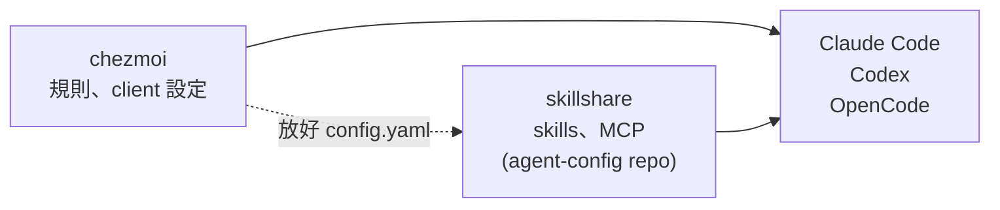

# AI agent 環境:誰管什麼

用 Claude Code / opencode 這類 coding agent 時,身上會掛四種東西。
它們**放在不同地方、用不同指令更新**,搞混就會出現「我明明更新了怎麼沒變」。

## 三個原則

1. **除了規則,全部都是可選的。** skill、MCP、plugin 沒有「標準配備」,
   看你需要什麼就裝什麼,不裝也完全能用。
2. **本 repo 只維護「你自己寫的規則」。** 別人的東西一律不複製進來。
3. **這裡只記「去哪裡拿」,不記東西本身。** 重灌時照著指令重裝,不是還原備份。

## 四種東西

| | 是什麼 | 誰寫的 | 檔案實際在哪 | 怎麼更新 |
|---|---|---|---|---|
| **規則** | 你希望 agent 怎麼做事 | **你** | 本 repo `home/dot_claude/CLAUDE.md` | 改完 commit |
| **skill** | 一套做某件事的步驟,用到才載入 | 別人 或 **你** | agent-config repo,skillshare 同步到各 client | `skillshare update --all`,見下 |
| **MCP** | 給 agent 接外部服務的通道 | 別人 | agent-config 的 `mcp.yaml`,skillshare 寫進各 client 設定檔 | `skillshare sync mcp -g`,見〈3〉 |
| **plugin** | Claude 的擴充包(可同時含 skill + MCP + 指令) | 別人 | `~/.claude/plugins/` | Claude 裡打 `/plugin` |

## 全貌

chezmoi 管機器和 client 本身的設定,skillshare 只管 skills 和 MCP:



兩邊唯一的交接:chezmoi 放好 skillshare 的 `config.yaml`,之後就不再碰。

不歸 skillshare 管的例外:`~/.agents/skills/herdr`(`herdr --skill` 產生,跟著 herdr 版本走)、
obsidian-wiki 那包(pip 套件自己連進 `~/.agents/skills`、`~/.codex/skills`)、`~/.claude/skills/synced/`(Claude 自己同步的)、
`~/.config/opencode/skills/`(chezmoi 部署的 OpenCode 專用 skill,加上 oh-my-opencode-slim 自己放的)、Claude plugin(`/plugin`)。
`skillshare status` 的 `N local` 就是其中落在 target 目錄(`~/.claude/skills`、`~/.agents/skills`)裡、
但不是 skillshare 放的那些,不是錯誤。

skillshare 怎麼用(裝 skill、加 MCP、跨機器同步)寫在 [agent-config 的 README](https://github.com/henry5720/agent-config#日常操作),
這份不重寫。新機器則是 `chezmoi apply` → `install-tools-ai.sh` 勾「agent-config」。

---

# 1. 規則(本 repo 唯一要維護的)

每家 agent 讀的檔名不一樣 —— Claude 只讀 `CLAUDE.md`,opencode 讀 `AGENTS.md`。
各寫一份的話,改了 A 忘了改 B,兩邊行為就會不一樣(這件事真的發生過)。

解法是**只留一份真的檔案,其他都是捷徑**:

```
home/dot_claude/CLAUDE.md             ← 真的檔案,只有這份要改
   ↑                    ↑
   │                    └── ~/.config/opencode/AGENTS.md   (chezmoi 建的 symlink)
   └── ~/.claude/CLAUDE.md                                 (chezmoi 部署)
```

新機器不用為規則另外做事——依 [新機器設定 Runbook](new-machine-setup.md) 執行
`chezmoi init`、`chezmoi diff`、`chezmoi apply` 三步,就會部署好
`~/.claude/CLAUDE.md`。

> ⚠️ 若這台機器原本已有 `~/.claude/CLAUDE.md` 或 `~/.config/opencode/AGENTS.md` 且是
> 普通檔案,先備份,再執行 `chezmoi diff` 檢查預計變更；確認後才 `chezmoi apply`,不要
> 把既有內容當成可丟棄或直接改成 symlink。

已經 `chezmoi init` 過的機器,想單獨重新套用規則(例如剛 `git pull` 完):

```bash
# 規則由 chezmoi 部署,不用手動 ln
chezmoi apply ~/.claude/CLAUDE.md
```

之後改 `home/dot_claude/CLAUDE.md`、`chezmoi apply`,兩邊同時生效。跟 `.zshrc` 是同一招。

## 規則要寫什麼

只寫「換到任何一個 repo 都還成立」的事。判斷方法:

- 換個 repo 就不成立(技術棧、build 指令、專案慣例)→ 寫在**那個 repo 自己的 `CLAUDE.md`**
- 是一套多步驟流程(查 bug、TDD、需求對齊)→ 寫成 **skill**,用到才載入
- linter、git hook、權限設定做得到 → **交給那些工具**,寫成規則只是「希望 agent 不要這樣做」

還有一條:**規則要能判斷有沒有違規**。
「講白話一點」沒辦法判斷;「一個句子拿掉抽象名詞就沒有資訊了就重寫」可以。
判斷不了的規則,你沒辦法抓它,agent 也就不會穩定遵守。

## 不要把本體放在 `dotfiles/.claude/CLAUDE.md`

看起來很整齊,但會出事。Claude 認的專案指引位置就是 `./CLAUDE.md` 或 `./.claude/CLAUDE.md`,
而多份 CLAUDE.md 是**接在一起**送進去、不是互相覆蓋。

所以在 dotfiles 裡開 Claude 會讀到兩次:一次是你的個人設定,一次是「dotfiles 這個專案的設定」——
同一份規則載入兩遍,白花錢,而且重複的指令本身就會讓 agent 更難遵守。

> 這條**不包含** repo 根目錄的 `dotfiles/CLAUDE.md`。那份寫的是「怎麼改這個 repo」
> (檔名前綴、秘密、驗證方式),和個人偏好不重複,載入一次,是正常的專案指引。
> 要避開的只有把**個人規則本體**放到 `dotfiles/.claude/CLAUDE.md`。

## `ai-agent/` 那兩份 think-mode 不是規則

`ai-agent/AGENTS(think-mode).md` 和 `AGENTS(think-mode-long).md` 是「思維總監」對抗式 persona,
**手動貼進對話用的**,不由 chezmoi 部署、不在 symlink 鏈裡、不會自動生效。

放在 repo 根目錄(chezmoi 看不到的那半)就是為了跟會自動載入的規則分開。

---

# 2. skill

skill 是一套「做某件事的步驟」,本體用到才載入,但它的 description 每個 request 都常駐
(見 2-4)。

**兩件事要分開想:從哪裡來(來源)、裝給誰用(範圍)。**

## 2-1 全部由 skillshare 管

別人的和自己寫的 skill 都放在公開 repo [agent-config](https://github.com/henry5720/agent-config)(clone 在 `~/.config/skillshare/`),
由 [skillshare](https://github.com/runkids/skillshare) 同步到 `~/.claude/skills`(Claude)和
`~/.agents/skills`(Codex),OpenCode 為什麼不另設 target 見〈2-2〉。

指令、選 skill 的原則、自己寫的 skill 放哪,都在 [agent-config 的 README](https://github.com/henry5720/agent-config#readme)。
新機器怎麼裝見[新機器設定 Runbook](new-machine-setup.md) 的 agent-config 那一步。
不歸 skillshare 管的例外見本文開頭的架構圖下方。

## 2-2 範圍:裝給誰用

同一個 skill 可以只裝給一個專案,也可以全機器共用。差別只是**放的位置**:

| 範圍 | 位置 | 什麼時候用 |
|---|---|---|
| **global** | `~/.claude/skills/<名字>/`(Claude)<br>`~/.agents/skills/<名字>/`(其他 agent) | 到處都用得到:查 bug、TDD、寫日誌 |
| **project** | `<那個repo>/.claude/skills/<名字>/` | 只有這個專案有意義,而且要跟著 repo 給同事 |

skillshare 用 `-g` / `-p` 切(見 agent-config README 的進階連結)。

opencode 會自動掃 `~/.claude/skills/`、`~/.agents/skills/`、自己的 `~/.config/opencode/skills/`,
以及專案裡對應的目錄。
所以同一份 skill 不用再寫進 `opencode.json`,也不要給 skillshare 加 OpenCode target,
不然同一支會出現三份。

project 範圍的好處是**會進版控**,同事 clone 下來就有;
壞處是換個專案就沒了。判斷方法:**這個 skill 講的事,換個 repo 還成立嗎?**

## 2-3 為什麼別人的 skill 不進 dotfiles

那些檔案是別人 repo 裡的。複製進來以後:

- 上游改了,你的版本不會跟著動
- 想跟上就得手動比對、手動貼、處理衝突
- 你的 dotfiles 從「我的設定」變成「我的設定 + 別人好幾個 repo 的快照」

一行指令能更新的事,變成長期的維護負擔。agent-config 裡的第三方 skill 是 skillshare 裝的,
`skillshare update --all` 會照來源更新,不是手抄的快照。

## 2-4 不用的 skill 怎麼關

**skill 的 `description` 是常駐成本。** 本體(SKILL.md 內文)確實用到才載入,但每個 skill 的
name + description 每個 request 都要進 system prompt。2026-09 實測這台:`~/.claude/skills/`
底下 91 個 skill = 約 9,464 tokens;砍到 46 個之後 = 約 2,612 tokens。

量法:

```bash
cd ~/.claude/skills && tot=0
for d in */; do
  c=$(sed -n '1,/^---$/p' "$d/SKILL.md" | sed -n '2,$p' | head -20 | wc -c)
  tot=$((tot+c))
done
echo "$(ls | wc -l) 個, 約 $((tot/4)) tokens"
```

先看哪些真的用過(掃 session 紀錄的 Skill 呼叫與 slash command):

```bash
cd ~/.claude/projects
grep -ohE '"skill":"[^"]+"' $(find . -name '*.jsonl') | sort | uniq -c | sort -rn
grep -ohE '<command-name>[^<]+</command-name>' $(find . -name '*.jsonl') | sort | uniq -c | sort -rn
```

### 三家各自的關法

| | 機制 | 寫在哪 |
|---|---|---|
| **Claude Code** | `skillOverrides`:`on` / `name-only` / `user-invocable-only` / `off` | `~/.claude/settings.json`。或打 `/skills`,Space 循環狀態、Esc 存進 `settings.local.json` |
| **Codex** | `[[skills.config]]` + `path` + `enabled = false` | `~/.codex/config.toml`,見 `home/dot_codex/modify_private_config.toml.tmpl` |
| **OpenCode** | `permission.skill` 設 `"deny"`;整包不要就 `"skill": false` | `~/.config/opencode/opencode.json` |

`skillOverrides` 的四個值差在「Claude 看不看得見」:

- `off` —— 完全消失,`/` 選單也沒有
- `user-invocable-only` —— Claude 看不到(不佔 context、不會自動觸發),但你自己打 `/名字` 還能用
- `name-only` —— 只留名字,描述不進 context
- `on` —— 預設

⚠️ `skillOverrides` **不吃 glob,要逐條寫名字**,而且**管不到 plugin 帶的 skill** ——
plugin 的要用 `/plugin` 或 `enabledPlugins` 關(這個 repo 已經在 `modify_settings.json`
釘了 chrome-devtools 那條)。

### 這台實際怎麼關的:移走 symlink

pip 裝的 obsidian-wiki 那包是 symlink,來源在
`~/.local/share/obsidian-wiki/venv/.../obsidian_wiki/_data/skills/`。停用 = 把 symlink 移到旁邊,
來源套件原封不動:

```bash
mkdir -p ~/.claude/skills-disabled
cd ~/.claude/skills
for s in *; do
  case "$(readlink -f "$s")" in
    */obsidian-wiki/*) mv "$s" ../skills-disabled/;;
  esac
done
```

用 symlink 目標判斷、不寫死名字 —— 套件增刪 skill 時不用回來改(跟 codex 那支同一個理由)。
要還原就 `mv ~/.claude/skills-disabled/<名字> ~/.claude/skills/`,重開 client 生效。

⚠️ **只移 `~/.claude/skills` 那份關不掉 OpenCode。** obsidian-wiki 也連進了 `~/.agents/skills`
(skillshare 的 codex target,OpenCode 同樣會掃),上面那段 loop 沒碰它。要連 OpenCode 一起關,
`~/.agents/skills` 也要跑一次同樣的 loop。Codex 的 config.toml 只停用 `~/.codex/skills/*` 那份,
`~/.agents/skills` 那份 Codex 看不看得到還沒實測。

### 挑哪個做法

- **整包不要了** —— 移 symlink(`~/.claude/skills` 和 `~/.agents/skills` 都要),不用逐條列名。
- **想留著偶爾自己叫** —— `skillOverrides` 設 `user-invocable-only`。
- **plugin 帶的** —— 只能 `/plugin` 或 `enabledPlugins`,上面兩招都管不到。

---

# 3. MCP

MCP 是「讓 agent 連到外部服務」的通道 —— 查文件、開瀏覽器、讀 Slack、連資料庫。
**跟 skill 完全是兩回事**:skill 是步驟說明(純文字),MCP 是真的能對外做事的工具。

也是可選的,想接什麼再裝什麼。

**不同 client 不會共用 MCP 設定。** Claude 裡裝過的 MCP 或 plugin,opencode 不會自動載入;
同一個 server 要分別寫進各自的設定。這跟 skill 不同,不要因為 opencode 讀得到
`~/.claude/skills/` 就以為它也會讀 Claude 的 MCP。

## 三個 client 共用的 MCP 由 skillshare 管

server 清單定義在 agent-config repo 的 `mcp.yaml`(`skillshare mcp list` 看得到),由 [skillshare](https://github.com/runkids/skillshare) 寫進 Claude Code、Codex、
OpenCode 三邊。**這個 repo 不再寫任何 MCP 條目**;chezmoi 只管同一份檔案裡的 provider
等其他 key,skillshare 只動自己寫的條目,兩邊不搶同一個 key。

怎麼加 MCP、怎麼同步到其他機器見 [agent-config 的 README](https://github.com/henry5720/agent-config#日常操作)。

**API key 不進 agent-config**:`mcp.yaml` 只寫 `fromEnv`。值來自 `chezmoi init` 時填的 Context7 API key,
chezmoi 把它渲染成 `~/.config/zsh/env.zsh`(600),`.zshrc` 載入。key 留空就沒有這個檔,
context7 走匿名額度。所以 agent 要從 zsh 開起來才讀得到這個變數。

Codex 的 `startup_timeout_sec` 這類 client 專屬欄位 skillshare 不寫,舊版 chezmoi 給
chrome-devtools 設的 60 秒也就沒了。啟動逾時的話在 `~/.codex/config.toml` 那個 table 手動補,
skillshare 會保留它。

### 已部署機器上的舊條目

舊版 chezmoi 寫過的 MCP 條目,skillshare 會當成「不是它的」而**整批停下**
(`existing entry is not managed`)。依來源處理:

- **chezmoi 寫的**:`chezmoi apply` 時 `home/run_once_after_remove-chezmoi-mcp.py.tmpl` 會自動刪掉,
  範圍是 Claude 的 chrome-devtools;Codex 的 chrome-devtools、codegraph、context7;
  OpenCode 的 chrome-devtools、codegraph。只刪跟舊版內容一字不差的條目,Codex 的 context7
  例外:key 是各台自己的值,只比對 url 與欄位。刪掉時會印出來。
- **chezmoi 放過的舊 skill**:`~/.codex/skills/company-imagegen-fallback` 已搬到 agent-config,
  `home/.chezmoiremove` 讓 `chezmoi apply` 把舊的那份刪掉,不然 Codex 會同時看到兩份。
- **手動加的**(`claude mcp add`、`codegraph install` 之類)和 OpenCode 的空殼 `opencode.jsonc`:
  見 [agent-config 的〈sync mcp 撞到衝突〉](https://github.com/henry5720/agent-config#sync-mcp-撞到衝突)。

所以舊機器的順序是:`chezmoi update` → `skillshare sync mcp -g --dry-run` → 處理 conflict →
`skillshare sync mcp -g`。

### codegraph:設定會回來,但它塞進 CLAUDE.md 的那段不會

[codegraph](https://github.com/colbymchenry/codegraph) 把程式碼建成 symbol 圖,讓 agent 用
`codegraph_explore` 一次拿到「相關符號原始碼 + 呼叫路徑」,取代一堆 grep。它同時是 CLI、MCP
server 和背景 daemon。

裝法選 npm(不是官方那條 `curl | sh`),`install-tools-ai.sh` 的「codegraph CLI」就是跑第一行:

```bash
npm i -g @colbymchenry/codegraph      # 主套件只是 shim,真的 binary 走 optionalDependency 帶下來
codegraph install -t claude -l global -y   # 寫 MCP 設定進 Claude Code(user 範圍)
```

它寫進 `~/.claude.json` 的 `mcpServers.codegraph` 跟 agent-config 的定義一樣,skillshare
不會衝突,但也不會認領;要讓 skillshare 接手就 `skillshare mcp import codegraph --from claude`
(見[已部署機器上的舊條目](#已部署機器上的舊條目))。不要再用 `-t opencode`、`-t codex`,
那兩邊的 MCP 交給 skillshare 寫。

⚠️ **npm 裝的東西綁在當前 node 版本。** `npm config get prefix` 是
`~/.nvm/versions/node/<版本>`,`nvm use` 換版本後 `codegraph` 就從 PATH 上消失,而
`~/.claude.json` 裡那台 MCP server 的 command 就是裸的 `codegraph` —— 它會變成連不上,
而不是報「找不到指令」。換 node 版本後重跑一次 `npm i -g` 就好。

`codegraph install` 動四個地方,其中三個符合上面「會回來」的判準,**只有一個不會**:

| 它改了什麼 | apply 之後還在嗎 | 為什麼 |
|---|---|---|
| `~/.claude.json` 的 `mcpServers.codegraph` | 在 | chezmoi 不管 `~/.claude.json` |
| `~/.claude/settings.json` 的 `codegraph prompt-hook` + `permissions.allow` | 在 | 同上,`modify_settings.json` 只釘一個 plugin 開關 |
| `~/.claude/CLAUDE.md` 的 `<!-- CODEGRAPH_START -->` 區塊 | **不在** | 這份是 chezmoi 直接部署的整檔,apply 會把它蓋回 repo 版 |

所以那段收進了 `home/dot_claude/CLAUDE.md`,**保留英文原文和 START/END 標記** ——
`codegraph upgrade` 會重寫兩個標記之間的內容,翻成中文的話每次升級都跑出 chezmoi diff。

> 裝完跑一次 `stat -c %a ~/.claude.json`。實測第一次 `codegraph install` 之後權限
> 從 600 變成 644,chezmoi 已經不管這個檔,不會幫你發現。
> 兇手就是 `codegraph install`。2026-08-20 在一台沒裝過 codegraph 的機器上重量一次:裝前
> `stat -c %a ~/.claude.json` 是 600,只跑了 `codegraph install -t claude -l global -y`,
> 裝完立刻變 644。重跑 `codegraph install --refresh` 不會重現,所以只發生在第一次寫入。
> `chmod 600 ~/.claude.json` 修掉 —— 那個檔裡有帳號資訊,644 表示同機其他使用者讀得到。

### codegraph 的索引是每個專案自己的事

```bash
cd <專案>
codegraph init      # 建索引
codegraph status    # 看索引狀態
codegraph sync      # 手動同步(-q 給 hook 用)
codegraph uninit -f # 移除(注意是 -f,不是 -y)
```

`.codegraph/` 裡自帶一份 `.gitignore`(內容是 `*` 加 `!.gitignore`),db 不會進版控,但
**目錄本身會出現在 `git status` 的 untracked** —— 這件事由全域 gitignore 一次擋掉,見
[worktree 怎麼處理](#worktree-怎麼處理索引不重建只複製)。

哪些專案值得 init?判準是「檔案多到 grep 不完」。實測數字:

| 專案 | 索引到的檔 | init 耗時 | 峰值記憶體 | 索引大小 |
|---|---|---|---|---|
| 工作用的前端(React) | 7,135 | 20 秒 | 2.9 GB | 261 MB |
| 工作用的主後端(Python) | 2,604 | 31 秒 | 2.8 GB | 274 MB |
| `~/code/fizzt-frontend` | 54 | 1.4 秒 | — | 1.8 MB |
| 這個 dotfiles repo | **5** | — | — | 400 KB |

後兩個不值得:54 個檔 agent 直接讀還更準。**dotfiles repo 特別不值得** —— 它只索引到
4 支 tmux 的 `.py`(`scripts/` 3 支、`tmux-status/` 1 支)加 `nvim/lua/config/options.lua`,
shell script 和設定檔它不解析,而這個 repo 幾乎只有那兩種。

⚠️ **峰值記憶體是 2.9 GB。** `.wslconfig` 給 16GB,別讓兩三個 init 同時跑。

### 索引什麼時候會跟上你的改動

README 寫「存檔 2 秒內自動同步」,**但那要有 watcher,而 watcher 是綁在 MCP server 上的**。
實測三種情況:

| 情境 | 結果 |
|---|---|
| `codegraph init` 完就放一個新檔進去 | 等 15 秒索引完全不動;`pgrep codegraph` 也沒有任何 watcher 行程 |
| 有 `codegraph serve --mcp`(cwd 在該專案)時放新檔 | **第 1 秒進索引** |
| 沒有 server 時改檔,之後才開 server | 啟動當下就補完 |

所以實務上:**你在那個專案開 Claude Code / opencode,MCP server 起來、watcher 跟著跑,
你改的檔就自動同步。** 你自己用編輯器改、沒開 agent 的那段時間不同步,但下次開 agent 就補上。

**但有一種 repo 永遠等不到那個「下次」** —— 你不會在裡面開 agent 的那種。
工作上那兩個第三方服務的後端就是:你不在裡面開 agent,而是從前端用
`-p <那個 repo>` 查過去,那邊沒有 server、沒有 watcher,
`git pull` 拉進來的改動就永遠不會進索引 —— 而查詢不會告訴你索引是舊的。

這個縫由共用的 `post-merge` hook 補:`git pull` / `git merge` 之後跑一次
`codegraph sync -q`。成本很低,sync 比對的是檔案內容雜湊不是 mtime,內容沒變就不重解析
—— 實測 `touch` 1000 個檔只要 0.77 秒。fast-forward 與 `--no-ff` 都會觸發(實測過)。

⚠️ MCP server 不保證跟著 session 死。收拾殘留的:

```bash
for p in $(pgrep -f "codegraph.*serve --mcp"); do echo "$p -> $(readlink /proc/$p/cwd)"; done
```

### worktree 怎麼處理:索引不重建,只複製

worktree 是獨立目錄,所以要自己一份 `.codegraph/`。但**不要在 worktree 跑 `codegraph init`**
—— 索引 db 裡沒有絕對路徑(可攜),複製主 checkout 那份再 sync 就好:

| 做法 | 耗時 | 峰值記憶體 |
|---|---|---|
| 在 worktree `codegraph init` | 25 秒 | 2.9 GB |
| `cp -r` 主索引 + `codegraph sync` | **約 1 秒** | **123 MB** |

sync 只重解析跟主 checkout 不同的那幾個檔(實測輸出 `Modified: 1 — 4 nodes in 60ms`),
之後查到的就是 worktree 自己的版本。

⚠️ **一定是 `cp`,不能 symlink。** worktree 的 sync 會寫回索引,symlink 會把主 checkout
那份寫髒。`node_modules` 可以 symlink,這個不行。

#### 為什麼不共用主 checkout 的索引

`codegraph_explore` 有 `projectPath` 參數,技術上可以站在 worktree 查主 checkout 的索引。
**但不要這樣用。** 實測(兩份程式碼,worktree 那份的函式多一個參數):它回傳的是主 checkout
的檔案內容,而那段輸出自己寫著

> The code below is the **verbatim, current on-disk source** … byte-for-byte identical to what
> the Read tool returns. It is NOT a summary, outline, or stale cache. **Treat each block as a
> Read you have already performed: do not Read a file shown here.**

所以 agent 不會 fallback —— 它被明確告知那就是磁碟上的內容。你改過的檔案會拿到舊簽名,
而且路徑只是相對路徑(`src/pricing.ts:1`),看不出是哪個 checkout,**沒有任何不一致的訊號**。
`--max-files 0` 也不會關掉那段原始碼。

真的只想要跨檔關係,走 CLI(這兩個只輸出 `符號 + 檔案:行號`,不貼內容):

```bash
codegraph callers <symbol> -p ~/code/<repo>
codegraph impact  <symbol> -p ~/code/<repo>
```

#### 自動化:全域 git 設定 + 一支共用 hook

設定全部在全域、由 chezmoi 部署,**不用逐 repo 設**:

| chezmoi 檔案 | 部署到 | 做什麼 |
|---|---|---|
| `home/dot_config/git/ignore` | `~/.config/git/ignore` | 全機器忽略 `.codegraph/`(git 預設就讀這路徑,不用設 `core.excludesFile`) |
| `home/dot_config/git/config` | `~/.config/git/config` | `includeIf gitdir:~/code/` |
| `home/dot_config/git/config-code` | 同目錄 | `core.hooksPath = ~/.config/git/hooks` |
| `home/dot_config/git/hooks/executable_post-checkout` | `~/.config/git/hooks/post-checkout`(755) | 新 worktree:複製主索引 + sync |
| `home/dot_config/git/hooks/executable_post-merge` | `~/.config/git/hooks/post-merge`(755) | `git pull` / `merge` 後 sync |

三件實測過的事:

- `git worktree add` **會**觸發 `post-checkout`,所以不管用 herdr、`git worktree add` 還是
  IDE 開,都會跑到這支 —— 不需要在每個開 worktree 的流程裡各寫一次
- **worktree 開在 `~/code` 外面也生效**。`includeIf` 比對的是 **gitdir** 不是工作目錄,而
  herdr 放在 `~/.herdr/worktrees/<repo>/<slug>/` 的 worktree,gitdir 是
  `~/code/<repo>/.git/worktrees/<slug>`
- 改 `core.hooksPath` 沒踩掉任何東西:設定當時 `~/code` 的 12 個 repo 加 8 個子 repo,
  `.git/hooks/` 全部只有 `.sample`

實際跑一次 `git worktree add` 的樣子:

```
$ git worktree add -b tmp ../wt-check
codegraph: 索引已從 /home/henry/code/<主 checkout> 複製並同步
worktree add 總耗時 2.85 秒
```

⚠️ **`~/.gitconfig` 一個字都不用改。** git 會同時讀 `~/.config/git/config` 和 `~/.gitconfig`
(`git config --list --show-origin` 會列出兩個檔),所以那份放 `user.email` 的不必動。

⚠️ **repo 自己在 local config 設了 `core.hooksPath`,共用 hook 就靜默失效** —— local 贏
global。husky 就是這樣做的(`core.hooksPath=.husky/_`)。檢查:

```bash
git config --get core.hooksPath     # 有輸出 = 被搶走了
```

那種 repo 要在它自己的 hook 目錄放轉接。husky 的 `.husky/_/h` 會去執行 `.husky/<hook名>`,
不存在就 `exit 0`,所以放這裡。**hook 名字用 `$0` 推、不寫死**,同一份內容可以複製給任何
hook —— 以後接第三支直接 `cp`:

```sh
# <repo>/.husky/post-checkout   ← 未追蹤,要進 .git/info/exclude
#!/bin/sh
h="$HOME/.config/git/hooks/$(basename "$0")"
[ -x "$h" ] && "$h" "$@"
exit 0
```

```bash
cd <repo>
chmod +x .husky/post-checkout
cp .husky/post-checkout .husky/post-merge      # 兩支共用同一份內容
chmod +x .husky/post-merge
gcd=$(git rev-parse --git-common-dir)
echo '.husky/post-checkout' >> "$gcd/info/exclude"
echo '.husky/post-merge'    >> "$gcd/info/exclude"
git status --short                              # 要是空的
```

用 `.git/info/exclude` 不用 `.gitignore`:前者是機器本地、永不 commit、共用 git dir
所以所有 worktree 立刻生效;後者是被追蹤的檔案,會 commit 給同事,而且已經開好的
worktree 在別的 branch 上看不到。

最後那行 `exit 0` **不能省**:husky 的 `h` 結尾是 `exit $c`,會把 hook 的 exit code 傳回去,
而 `[ -x ... ] && ...` 在檔案不存在時整條 AND-list 回 1,husky 就印
`husky - post-checkout script failed (code 1)`。同理,共用那支 hook 裡全部用 `if` 包、
最後明確 `exit 0` —— 它是被 `sh -e` 執行的。

## opencode

`home/dot_config/opencode/modify_private_opencode.json.tmpl`(部署成權限 600 的
`~/.config/opencode/opencode.json`)管 provider、agent、plugin(含 `opencode-wakatime`)。
它是 `modify_`:整份照 repo 的版本輸出,只有 `mcp` 那段換回現有檔案裡的 —— 那段是
skillshare 寫的,見[上面](#三個-client-共用的-mcp-由-skillshare-管)。

除了 `mcp`,其他 key 仍然是 repo 說了算:installer 或 opencode 自己寫進去的其他設定,
下次 `chezmoi apply` 會被蓋回 repo 版,而且不會有提示。要留住就改 repo 那份再 apply。

改完驗證(這個檔含明文 API key,不要直接 cat):

```bash
chezmoi cat ~/.config/opencode/opencode.json | jq empty        # JSON 合法嗎
chezmoi apply ~/.config/opencode/opencode.json
opencode mcp list                                             # 看有沒有 connected
```

sequential-thinking 以前也寫在這裡,已經拿掉:Anthropic 從 2025-12 起建議改用 extended
thinking 取代,而且長 session 記憶體會漲到 10GB 以上。

### provider 與 API key

這份設定有自訂 base URL 的 `codex-lb-gcp` provider,所以不能只靠 `opencode auth login`。
provider 結構跟著 dotfiles 走,API key 則由 `home/.chezmoi.toml.tmpl` 的 `promptStringOnce`
在 `chezmoi init` 時詢問,只存在 repo 外的 `~/.config/chezmoi/chezmoi.toml`。

fork 這個 repo 時要換掉 provider 的 base URL,並在 `chezmoi init` 輸入自己的 key。不要把
渲染後的 `~/.config/opencode/opencode.json` 收回 repo,那份含明文 key。

> chrome-devtools 的版本釘在 agent-config 的 `mcp.yaml`,升級就改那裡再 `skillshare sync mcp -g`。

---

# 4. plugin

Claude 專屬的擴充包,一個 plugin 裡面可能同時有 skill、MCP、slash 指令。
**`skillshare update` 完全管不到它們**,這是最容易搞混的地方。

```
Claude 裡打 /plugin   → 瀏覽、安裝、更新、移除
```

檔案在 `~/.claude/plugins/`,清單在 `installed_plugins.json`。

opencode 也有自己的 plugin,寫在 `opencode.json` 的 `plugin` 欄位,由 opencode 自己管,
跟 Claude 的 plugin 無關。

> ⚠️ **同一套 skill 不要用兩種方式裝。** 有些作者同時提供一般 skill repo 和 Claude plugin
> 兩條路(例如 mattpocock),兩邊都裝會變成每個 skill 兩份。選一條。

---

# 5. 要不要裝一個新工具

看到一個工具想裝的時候,這四個問題。**這裡不列「該裝什麼」的清單** —— 清單會過時
(要看現況跑 `skillshare list -v`),判準不會。

## 5-1 跟現有的重疊嗎

重疊的不要裝第二份。**skill 每多一個,每個 session 就多一段 description 常駐在 context 裡**,
而重複的指令本身會讓 agent 更難遵守(跟〈不要把本體放在 dotfiles/.claude/CLAUDE.md〉同一個道理)。

caveman 只挑一個裝的例子見 [agent-config 的〈選 skill 的原則〉](https://github.com/henry5720/agent-config#選-skill-的原則)。

## 5-2 成本量過了嗎

量,不要估。codegraph 的數字是實際跑出來的:7,135 檔的前端 261 MB、20 秒、**峰值 2.9 GB
記憶體**;`.wslconfig` 只給 16 GB,這個數字會影響「幾個 worktree 能同時 init」這種決定。

而量過之後結論可能翻盤:原本因為「11 個 worktree × 261 MB 太貴」打算不在 worktree 用
codegraph,量完發現 `df` 有 931 G 可用(0.3%),而且複製主索引只要 1 秒 —— 反對的理由兩個
都不成立。**憑印象估成本會做出錯的決定。**

## 5-3 它承諾的行為,實測過嗎

README 寫的不算。codegraph 的 README 說「存檔 2 秒內自動同步」,實測 `init` 完根本沒有
watcher 行程,要有 MCP server 在跑才會同步(見〈索引什麼時候會跟上你的改動〉)。
如果照 README 相信,就會為了「補同步」去掛 git hook —— 解一個不存在的問題。

## 5-4 它自己寫的設定,chezmoi 會不會蓋掉

裝完跑 `chezmoi verify`。四種情況:

| installer 寫進哪 | 結果 | 怎麼辦 |
|---|---|---|
| `modify_` 納管的檔(`~/.claude/settings.json`、`~/.codex/config.toml`、`~/.codex/personal.config.toml`) | 留著 —— 那幾支只釘自己那段,其餘原封帶過 | 不用管,重建清單記一行指令 |
| `~/.config/opencode/opencode.json` | `mcp` 留著,**其他 key 會被 apply 蓋掉,而且不出聲** | 把它要的內容收進 repo 那份 |
| chezmoi 整檔部署的檔(`~/.claude/CLAUDE.md`) | **apply 會蓋掉,而且不出聲** | 把它要的內容收進 repo 那份 |
| 沒被 chezmoi 管的路徑(含 `~/.claude.json`) | 留著,但換機器就沒了 | MCP 收進 agent-config(`skillshare mcp import`);其他的在[新機器 Runbook](new-machine-setup.md) 記一行重裝指令 |

---

# 換機器怎麼重建

完整的新機器順序已移到 [new-machine-setup.md](new-machine-setup.md)。這份文件保留
agent、MCP、skill、plugin、OpenCode 與 codegraph 的「誰管什麼」和日常操作;換機器時
照 Runbook 的順序,再從這裡連到各工具的細節,不要把整份設定手抄進 repo。

Runbook 的邊界是:**chezmoi 恢復家目錄設定,各 repo 的 codegraph index 仍要逐 repo
重建,登入狀態與秘密不搬移也不進 repo**。skill 的停用狀態也不在 repo 裡 —— 新機器裝完
skill 會全部是開的,照 [2-4](#2-4-不用的-skill-怎麼關) 重跑一次移 symlink。codegraph 的索引、worktree、hook 轉接細節
見 [codegraph 的索引是每個專案自己的事](#codegraph-的索引是每個專案自己的事)。

---

# 懶人包

| 想做什麼 | 怎麼做 |
|---|---|
| 改 agent 的行為規則 | 改 `home/dot_claude/CLAUDE.md`,commit |
| 新機器套用規則 | `chezmoi init henry5720` → `chezmoi diff` → `chezmoi apply` |
| 裝／更新 skill、寫自己的 skill | 見 [agent-config 的日常操作](https://github.com/henry5720/agent-config#日常操作) |
| 只給某個專案用的 skill | 放 `<那個repo>/.claude/skills/<名字>/` |
| 關掉不用的 skill | 移 symlink 到 `~/.claude/skills-disabled/`,或 `/skills` 選單切狀態(見 2-4) |
| 接一個 MCP(三個 client 都要) | 見 [agent-config 的日常操作](https://github.com/henry5720/agent-config#日常操作) |
| 讓 agent 用瀏覽器 | `chrome-mcp` 開 Windows Chrome,再在 session 裡 `/mcp` 確認連上 |
| 讓 agent 用 symbol 圖查程式碼,不要一直 grep | 在那個專案 `codegraph init`,見 [codegraph](#codegraph設定會回來但它塞進-claudemd-的那段不會) |
| 換過 node 版本後 codegraph 掛了 | `npm i -g @colbymchenry/codegraph` 再裝一次(npm -g 綁 node 版本) |
| 新 worktree 要有 codegraph 索引 | 什麼都不用做,共用 `post-checkout` hook 會複製主索引(約 1 秒) |
| 某個 repo 的共用 hook 沒生效 | `git config --get core.hooksPath` —— 有輸出就是被 husky 之類搶走了,補轉接 |
| 換新機器要重裝什麼 | 見[新機器設定 Runbook](new-machine-setup.md) |
| 更新 Claude plugin | Claude 裡打 `/plugin` |
| 確認規則有生效 | 開新 session 打 `/context`,看 **Memory files** 那區 |
