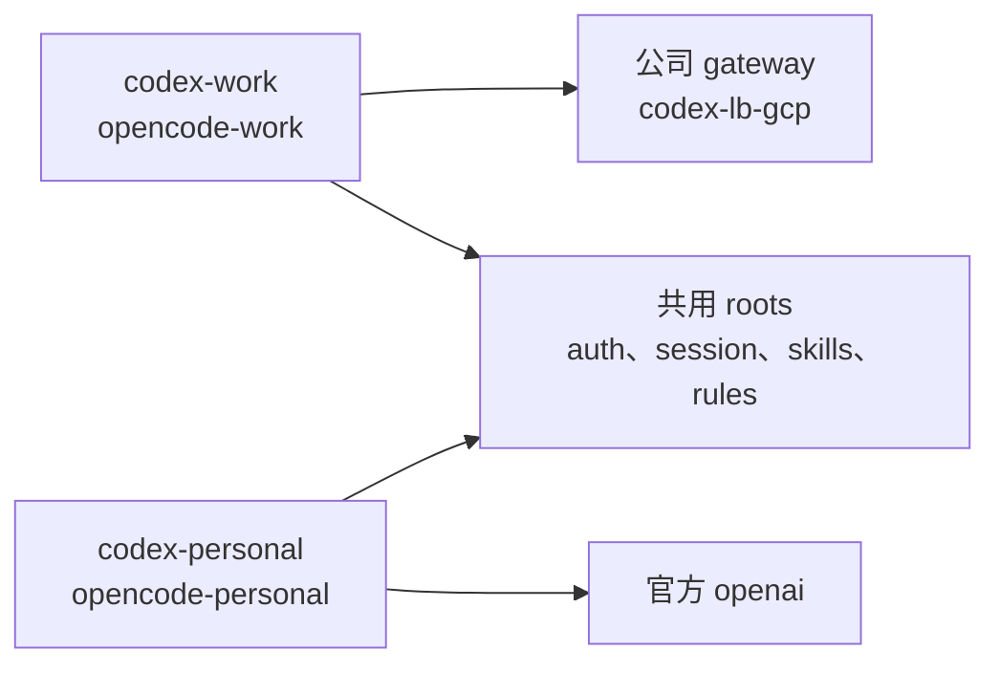

# AI profile routing

部署後使用四個入口切換環境：

| 入口 | 環境 |
|---|---|
| `codex-work` | 原本的公司 `~/.codex` |
| `codex-personal` | 共用 `~/.codex` 的 `personal` profile，官方 ChatGPT OAuth |
| `opencode-work` | 原本的 OpenCode XDG roots |
| `opencode-personal` | 共用 OpenCode roots，只切 personal routing view |

四個都是 `~/.local/bin/ai-profile` 的 symlink，靠檔名判斷身分。裸 `codex`、`opencode` 不變。



個人入口**只切 provider/model**，不是第二份 runtime：roots、auth、session、cache、skills、
rules、prompt、TUI、MCP 都跟公司共用（skill 有一個例外，見下），也不宣稱公司 skills、MCP 或 remote attach 受 model 限制。

## 個人入口實際改了什麼

- **`codex-personal`** = `codex --profile personal`，只用官方 `openai` provider。
  `login`／`logout` 原生轉送、不加 `--profile`。
- **`opencode-personal`** 把 `OPENCODE_CONFIG_DIR` 指到 `~/.config/opencode/routes/personal/`，
  OMO preset 設成 `personal`，並用 `OPENCODE_CONFIG_CONTENT` 強制 `enabled_providers = ["openai"]`
  —— project 的 gateway、model mapping 因此不生效。原本 inline 的 `OPENCODE_CONFIG_CONTENT`
  只保留非 routing 欄位。
- route view 裡的 `skills`、`oh-my-opencode-slim`、`AGENTS.md`、`tui.jsonc` 都是整個連回
  global 的 symlink，不另外放同名 skill，避免 loader collision。OMO plugin 固定 2.2.18。
- 唯一的 skill 差異：兩個個人入口都停用 `company-imagegen-fallback`（Codex 在
  `personal.config.toml` 的 `[[skills.config]]`，OpenCode 在 route 的 `permission.skill`）。
- 其餘 argv、cwd、project/native loader 語意照原樣。provider 相關的環境變數**不會**被清掉，
  wrapper 只拿掉 `OPENCODE_*` 那幾個 route 變數（`opencode-personal auth login` 時）。

TUI interactive 與首次 plugin 初始化未在此 lane 驗證。

## 模型與登入

個人 profile 不猜模型。模型放在 chezmoi 的非秘密 `data.aiPersonal`：`codexModel`、
`models.astra`、`models.sol`、`models.luna`（`home/.chezmoi.toml.tmpl`）。留空時只產生合法的
setup config，launcher 會拒絕啟動（`help`、`models`、登入這類不需要 model 的指令除外）。
填妥後由 templates 產生 Codex model、OpenCode main/small model 與 OMO roles/council mapping
（對應關係見 `home/dot_config/opencode/routes/personal/oh-my-opencode-slim.json.tmpl`）。
模型 ID 由實際 entitlement 決定，不要填 placeholder。

登入手動完成，沒有自動登入或 API-key route：

```text
codex-personal login
opencode-personal auth login
```
