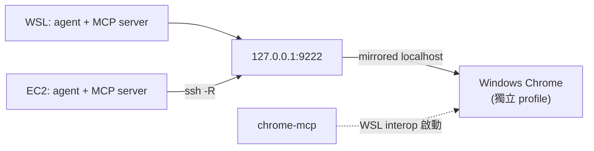

# chrome-devtools MCP:讓 agent 開你的瀏覽器

Claude Code、Codex、OpenCode 都接了 `chrome-devtools-mcp`,agent 因此能開網頁、點按鈕、看
console、抓 network、跑 lighthouse。這份記的是**這台機器上為什麼要這樣設**,不是這個 MCP
的用法(用法看[官方 repo](https://github.com/ChromeDevTools/chrome-devtools-mcp))。

## 前置與連線



需要 WSL interop 可呼叫 Windows `cmd.exe` / `powershell.exe`、Windows 已安裝 Chrome，且
`.wslconfig` 使用 `networkingMode=mirrored`（見 [`wsl/.wslconfig`](../wsl/.wslconfig)）。
9222 只綁 localhost，不要暴露到 LAN。

> ⚠️ **不要在 WSL 裝 Linux Chrome。** `npx puppeteer browsers install chrome` 會抓 80MB 到
> `~/.cache/puppeteer`,然後你有兩個瀏覽器、agent 連的還是錯的那個。方向就是錯的,設定本來
> 就是連 Windows 那台。

## 怎麼用

```bash
chrome-mcp        # 開 Windows Chrome 並開 9222;已經在跑就直接結束
```

部署自 [`home/dot_local/bin/executable_chrome-mcp`](../home/dot_local/bin/executable_chrome-mcp),
落在 `~/.local/bin/chrome-mcp`(那個目錄已經在 PATH 裡,見 `home/dot_zshrc` 第 3 節)。

**Chrome 要先跑起來，MCP client 才連得上。** 重開 Chrome 後，
Claude Code 可在 session 執行 `/mcp` 重連；其他 client 請用該 client 自己的 reconnect/restart 方法，
`/mcp` 不是所有 agent 通用指令。

script 做三件事,每件都是踩過才加的:

1. **先檢查 9222 通不通。** Chrome 已有實例時,再下一次帶參數的啟動會被**轉交給既有實例、
   新參數整組丟掉、而且不報錯**。沒這個檢查就會看到「指令跑完、沒紅字、MCP 還是連不上」。
   9222 上是別的服務(不是 DevTools endpoint)就直接失敗,不會去關既有的 Chrome。
2. **問 Windows 自己的 `%LOCALAPPDATA%`**,不寫死 `C:\Users\henry`。
3. **等 9222 真的通了才回報成功**,最多等 15 秒,逾時回傳非零。

## 第一次要手動登入

用的是獨立 profile(`%LOCALAPPDATA%\ChromeDevToolsMCP`),不是你日常那個。原因有兩個:
日常 profile 開著的時候 Chrome 會忽略 `--remote-debugging-port`;而且讓 agent 碰你日常瀏覽的
登入狀態不是好主意。

代價是這個 profile 第一次是全新的,要手動登入你想讓 agent 看到的網站。之後會保留 cookie。

> ⚠️ `9222` 等於**完整瀏覽器控制權**,包含那個 profile 裡所有登入狀態。只綁 localhost,
> 不要對 LAN 或網際網路開放。

## 設定放在哪

MCP server 的定義由 [skillshare](https://github.com/runkids/skillshare) 管,清單在
agent-config repo 的 `mcp.yaml`(chrome-devtools 的版本也釘在那裡)。`skillshare sync mcp -g`
把它寫進三個 client 各自的設定檔,只動自己寫的那幾個條目:

| client | 寫進哪裡 |
|---|---|
| Claude Code | `~/.claude.json` 的 `mcpServers` |
| Codex | `~/.codex/config.toml` 的 `[mcp_servers.*]` |
| OpenCode | `~/.config/opencode/opencode.json` 的 `mcp` |

這個 repo 只剩兩件跟 chrome-devtools 有關的事:

| 檔案 | 部署到 | 管什麼 |
|---|---|---|
| [`home/dot_claude/modify_settings.json`](../home/dot_claude/modify_settings.json) | `~/.claude/settings.json` | 關掉官方 chrome-devtools plugin |
| [`home/dot_local/bin/executable_chrome-mcp`](../home/dot_local/bin/executable_chrome-mcp) | `~/.local/bin/chrome-mcp` | 開 Windows Chrome 的 9222 |

Codex 與 OpenCode 那兩份設定檔 chezmoi 還在管 provider 等其他 key,所以它們的 `modify_` 會把
skillshare 寫的 MCP 條目原樣留著。新增、改參數、升版本都改 agent-config 的 `mcp.yaml`,
**不要改這個 repo**。

三個 client 的 Chrome DevTools 參數刻意保持一致:

```
--browser-url=http://127.0.0.1:9222   連 Windows 那台,不要自己開
--no-usage-statistics                 不回報使用統計
--no-performance-crux                 跑效能分析時不去 CrUX API 查別人網站的公開數據
```

## 為什麼要關掉官方那個 plugin

Claude Code 內建一個 chrome-devtools plugin,設定在:

```
~/.claude/plugins/cache/claude-plugins-official/chrome-devtools-mcp/<版本>/.claude-plugin/plugin.json
```

它的 `args` 只有 `["chrome-devtools-mcp@<版本>"]` —— **沒有 `--browser-url`**。所以它會想在
WSL 自己開一個 Chrome,然後失敗:

```
Protocol error (Target.setDiscoverTargets): Target closed
```

不關掉的話它會跟 skillshare 寫的那台 MCP server 同時出現,同一組工具兩份,Claude 有一半機率挑到壞的。

官方裝法(`claude mcp add chrome-devtools npx chrome-devtools-mcp@latest`)也生不出正確設定,
少的就是 `--browser-url`,所以參數要記在 agent-config 的 `mcp.yaml`,不能靠重跑 installer。

## EC2:用本機的 Windows Chrome

EC2 不裝 Chrome。MCP 設定跟 WSL 那份一樣(`--browser-url=http://127.0.0.1:9222`),把本機的
9222 用 SSH 反向轉過去就好(上面圖裡 `ssh -R` 那條):

```bash
chrome-mcp                                                        # 本機先把 Chrome 開起來
ssh company-ec2                                                   # ~/.ssh/config 已帶 RemoteForward 9222,連著就通
ssh company-ec2 'curl -s 127.0.0.1:9222/json/version | grep User-Agent'  # 要看到 Windows NT
```

最後那行一定要看 `User-Agent`。看到 `X11; Linux` 就是連到 WSL 裡別的 Chrome 了(見下方排錯)。

2026-09-25 在 company-ec2 實測:`chrome-devtools-mcp@1.10.1` 經這條路開頁、列頁、關頁都正常。

## 排錯

| 症狀 | 原因 |
|---|---|
| `Target closed` / `Target.setDiscoverTargets` | 走到沒有 `--browser-url` 的設定了 —— 官方 plugin 又被開起來(`chezmoi apply` 修回來),或 MCP 條目被改掉(`skillshare sync mcp -g` 修回來) |
| `chrome-mcp` 跑完沒錯誤但 MCP 連不上 | 9222 沒通。`curl 127.0.0.1:9222/json/version` 確認;不通就查 `.wslconfig` 是不是 mirrored |
| Chrome 開起來但 9222 不通 | 日常 profile 已經開著,Chrome 忽略了 `--remote-debugging-port`。關掉全部 Chrome 視窗再跑 |
| 開出來的分頁一直是 `about:blank`,`new_page` 等 30 秒逾時 | 9222 被 WSL 裡別的 Chrome 搶走了(例如 Playwright 起的 `ms-playwright/chromium`)。mirrored 模式下 WSL 裡有人在聽 9222,連 `127.0.0.1:9222` 就先到它,Windows Chrome 被蓋掉,而且不報錯。`ss -ltnp \| grep 9222` 看得到行程就是這個;關掉它 |
| Windows 的 MCP Chrome 還在跑,9222 卻不通,`chrome-mcp` 等 15 秒失敗 | 9222 被搶過一次之後,Windows Chrome 的 listener 就掉了,不會自己回來;再叫一次 Chrome,新參數也會被轉給舊的 process 然後丟掉。只關 `ChromeDevToolsMCP` profile 那個 Chrome,再跑 `chrome-mcp` |
| agent 看到的網站沒登入 | 獨立 profile 是新的,手動登入一次 |
| `claude mcp list` 顯示 Failed | 先確認 Chrome 在跑,再 `/mcp` 重連 |

驗證整條路通了:

```bash
chrome-mcp                                       # Chrome 起來
curl -s 127.0.0.1:9222/json/version | jq .Browser  # 看得到版本號
claude mcp list                                  # chrome-devtools 顯示 Connected
```
