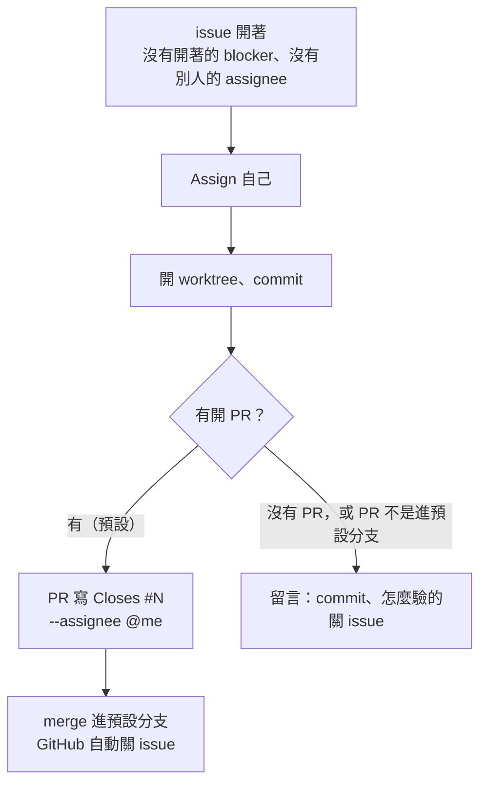
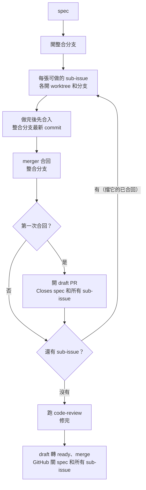
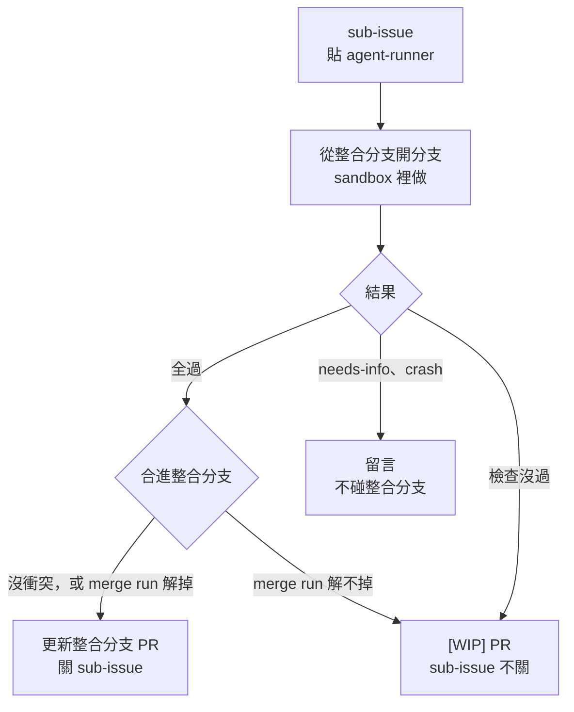

# Issue 生命週期

給人看的圖。agent 照的規則不在這裡，每張圖對照的來源不同，改規則時跟對照的那份一起改：

| 圖 | 對照的規則 |
| --- | --- |
| 一般 issue | [`home/dot_claude/CLAUDE.md`](../home/dot_claude/CLAUDE.md) 的「Issue 生命週期」（部署成 `~/.claude/CLAUDE.md`） |
| spec | 上游 `/implement-spec` skill |
| runner 做 spec 的 sub-issue | agent-runner 的 code 與 README 的〈[spec 的 sub-issue 走整合分支](https://github.com/henry5720/agent-runner#spec-的-sub-issue-走整合分支)〉 |

map 的流程由上游 `wayfinder` 決定，不在這裡。

## 一般 issue

## spec（底下有 sub-issue）

照上游 `/implement-spec`。

## runner 做 spec 的 sub-issue

sub-issue 一張一張貼 `agent-runner` label，runner 一次做一張，同一份 spec 一輪只做一張。開始做時 runner 把 sub-issue assign 給操作者，分支叫 `agent/<sub-issue 編號>`。

- 整合分支是 `agent/<spec 編號>`，第一張全過或 `[WIP]` 時才從 runner 設定的 `baseBranch` 建；建之前 sub-issue 的分支也從 `baseBranch` 開。
- `[WIP]` PR 是 `agent/<sub-issue 編號>` 進整合分支，人修好、merge 後手動關 sub-issue。
- 整合分支的 draft PR 第一張全過時開、之後每張更新，只寫 `Closes #<spec>`；sub-issue 合進去就由 runner 留言關，不等 PR merge。draft 轉 ready、merge 由人決定。
- merge run 是合併有衝突時再跑一次 sandbox，讓 agent 用 `resolving-merge-conflicts` 解。解完 push 被拒（期間有人往整合分支 push）也走 `[WIP]`；merge run timeout、crash 照 crash。
