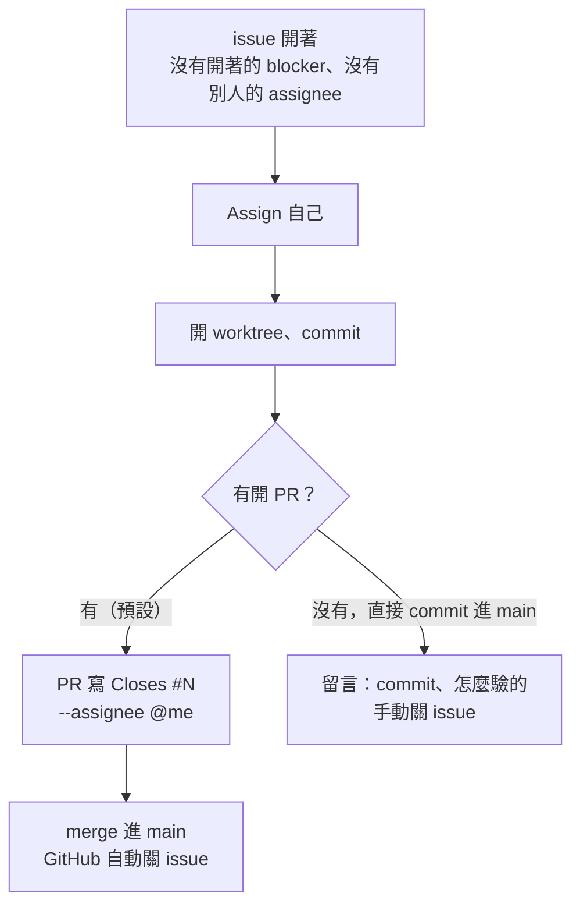
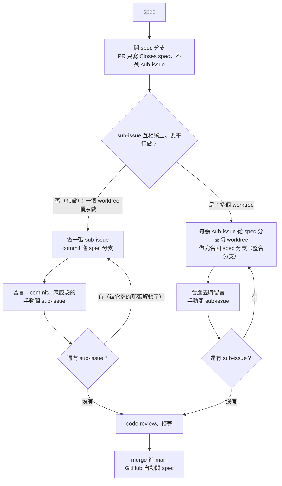

# Issue 生命週期

給人看的圖。agent 照的是 [`home/dot_claude/CLAUDE.md`](../home/dot_claude/CLAUDE.md) 的「Issue 生命週期」
（部署成 `~/.claude/CLAUDE.md`）。兩邊是同一套規則，改規則時兩邊一起改。map 的流程由上游 `wayfinder` 決定，不在這裡。

## 一般 issue

## spec（底下有 sub-issue）

sub-issue 不列進 PR 的 `Closes`：`Closes` 只在 PR 進 main 時生效，列了就要等整條分支進 main 才關，
被它擋的 sub-issue 會一直顯示 blocked。spec 要等 merge 才關，所以 **spec 開著＝這份還沒進 main**。
