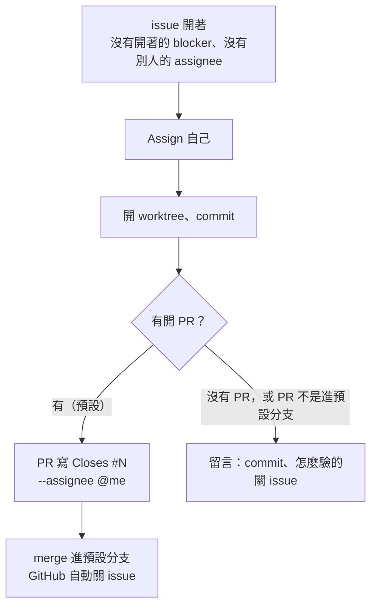
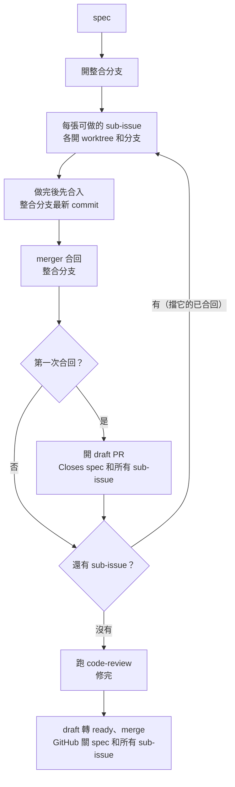

# Issue 生命週期

給人看的圖。agent 照的是 [`home/dot_claude/CLAUDE.md`](../home/dot_claude/CLAUDE.md) 的「Issue 生命週期」
（部署成 `~/.claude/CLAUDE.md`）。兩邊是同一套規則，改規則時兩邊一起改。map 的流程由上游 `wayfinder` 決定，不在這裡。

## 一般 issue

## spec（底下有 sub-issue）

照上游 `/implement-spec`。

