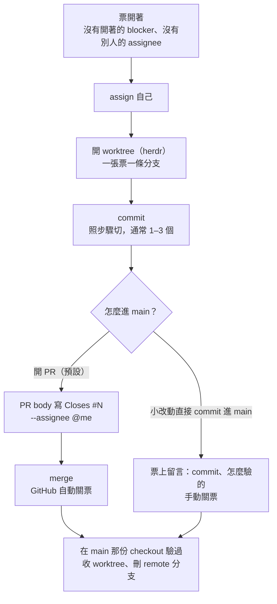
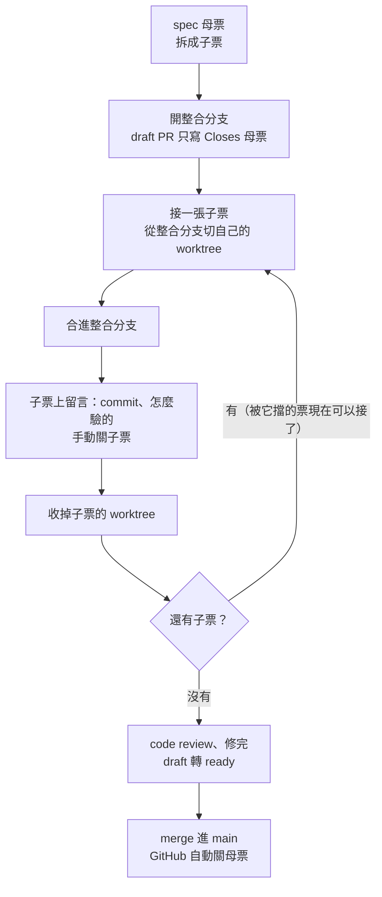

# 一張票的生命週期

給人看的流程圖。agent 照的是 [`home/dot_claude/CLAUDE.md`](../home/dot_claude/CLAUDE.md) 的
「Issue 生命週期」那段（部署成 `~/.claude/CLAUDE.md`），兩邊講的是同一套規則，改規則時兩邊一起改。

## 平常：一張票一條分支

絕大多數的票走這條。一張票 = 一個 worktree = 一條分支 = 一個 PR；分支裡的 commit 照步驟切，
通常 1–3 個。

票只會在兩個地方關：PR merge 時自動關，或沒有 PR 時手動留言再關。
**有 PR 就不要手動關** —— PR 還沒進 main，票先關掉的話，GitHub 上看起來做完了，main 上其實還沒有。

## 少數：很多張子票走一條整合分支

一份 spec（母票）拆成很多張子票，而且子票單獨進 main 會讓 main 停在做一半的狀態時才用。
例子：spec #59 拆成 #60–#68，子票先合進 `feat/chezmoi-install-flow`，全部做完才由 PR #69 一次進 main。

跟平常那條差在**子票在合進整合分支時就關**，不等進 main：

- 子票如果也寫進 PR 的 `Closes`，要等整條分支進 main 才會關。這段期間被它擋住的下一張票，
  在 GitHub 上一直顯示 blocked，即使程式碼早就在整合分支上了。
- 對子票來說，「做完」的意思是合進整合分支；整條功能進 main 這件事由母票負責追。

子票的 worktree 也是合進整合分支、在整合分支那份 checkout 驗過就收，不要留到母票 merge。
