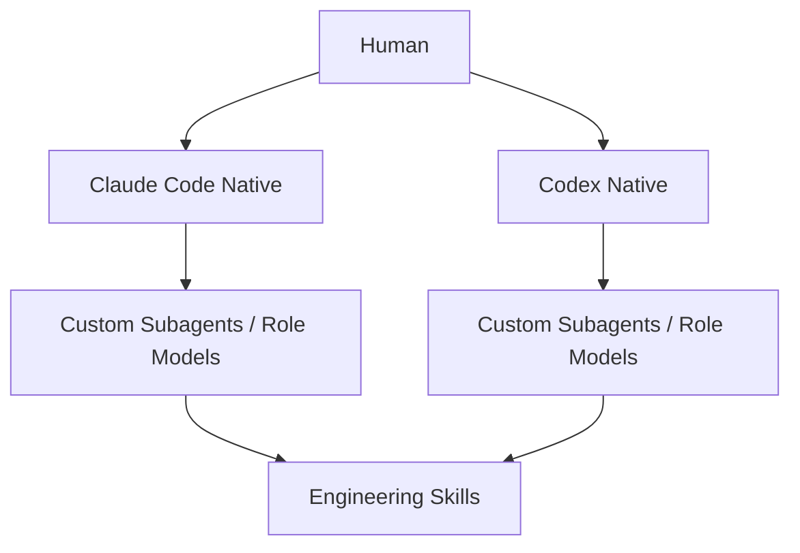
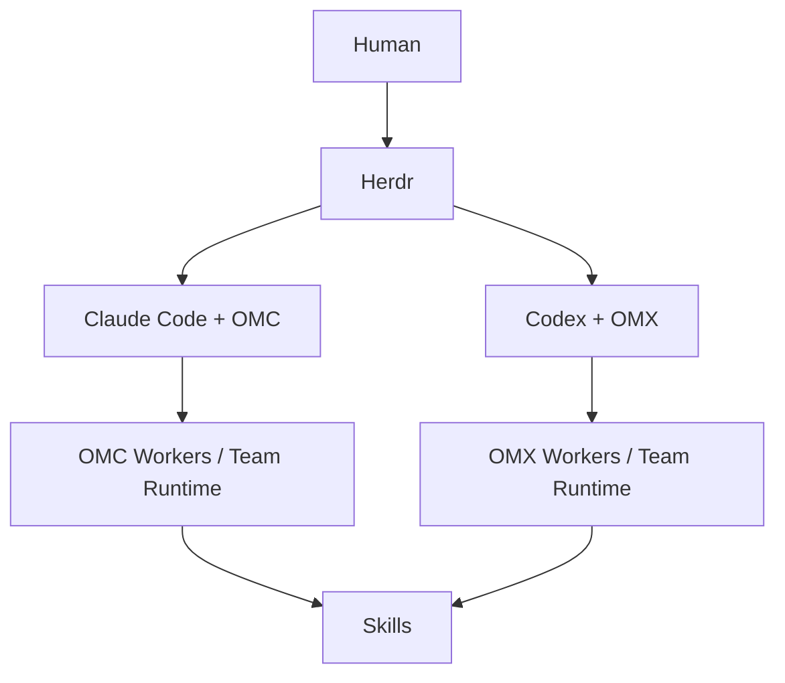
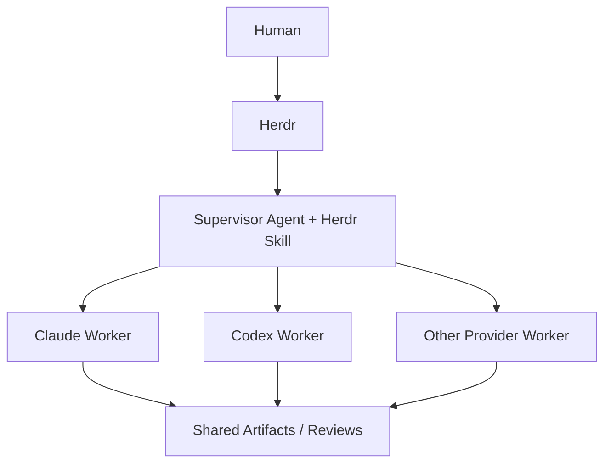
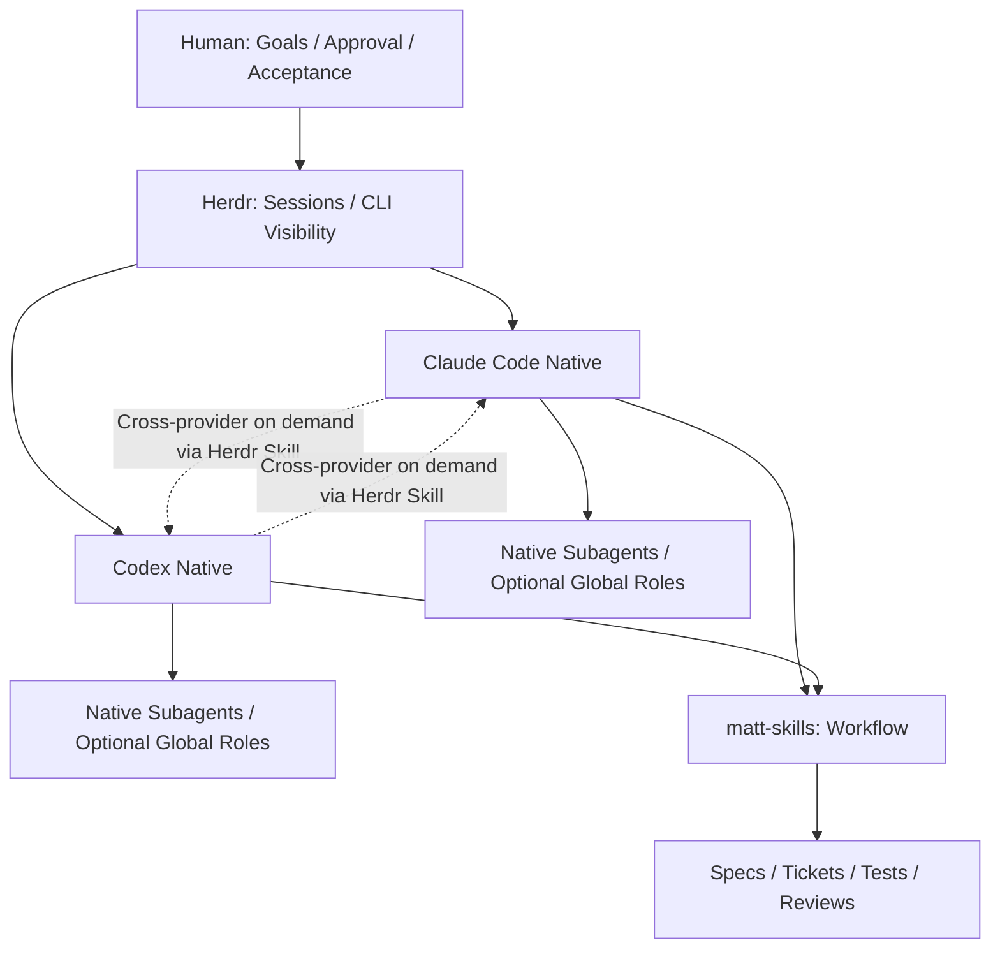
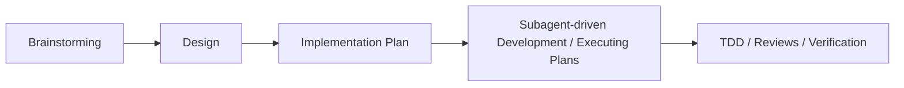

# Agentic Coding 架構與 Native 配置：研究整理

> 日期：2026-10-09  
> 用途：整理討論背景、研究發現、目前決策與尚未確認的問題；**非實作指令或執行計畫**。  
> 狀態：部分結論來自工具官方文件，部分為使用者實際經驗與架構判斷；2026-10-09 補上本機現況（見「九、本機現況」）。  
> **這份是開 map 前的背景，之後不再更新。** 後續決定記在 map 的 sub-issue（Wayfinder: Codex 自主執行與原生角色配置）。用語照 `GLOSSARY.md` 的「Agent 分工」。

## 一、研究背景與需求

目前使用 Herdr 管理多個 CLI Agent（主要 Claude Code、Codex；曾使用 OpenCode + OMO-slim），以 mattpocock/skills 為主要工程工作流，也使用過 Superpowers。目標是由人定義目標與驗收，讓 Agent 自主釐清、規劃、拆解、實作、測試、審查；必要時跨 Provider 協作。

核心訴求：

- 以 **Native-first** 為原則，盡量減少第三方 Harness、重複配置及維護負擔。
- Claude Code 與 Codex 的自主開發體驗盡量一致，尤其是長任務不中途停下、少做不必要的人工詢問。
- 希望能按任務使用合適 Role、Model / Reasoning Effort，但不為切模型而引入過度複雜的編排框架。
- 保留 Herdr 的跨 CLI / Provider 管理；目前已會在需要時指示 Agent 使用 Herdr 調度其他 Agent。
- 通用配置偏好 Global Scope，專案特有知識、限制與任務留在 Project Scope。

## 二、四個彼此關聯但應區分的問題

| 議題 | 核心問題 | 現況與判斷 |
|---|---|---|
| 1. Orchestration Architecture | Human、Herdr、主 Agent、Subagent 各自管理什麼？ | 傾向雙層架構；跨 Provider 按需透過 Herdr Skill |
| 2. Orchestration / Workflow Tools | OMO-slim、OMC、OMX、Matt、Superpowers 各自補足什麼？ | Native-first；第三方框架作為比較方案，不預設引入 |
| 3. Native Agent Configuration | Global/Project Roles、Model Routing、Skills 如何配置？ | 傾向少量通用 Roles；是否必要仍待實際配置盤點 |
| 4. Codex Runtime & Autonomy | 為何中途結束 Turn、頻繁詢問？如何與 Claude Auto Mode 接近？ | 當前最直接痛點；權限與提前結束是兩個不同問題 |

## 三、曾考慮的三種架構與目前選擇

### A. Native Custom Roles + Skills（無額外編排框架）

- 優點：配置輕、使用原生委派與角色模型設定。
- 限制：沒有統一的跨 Provider Session 管理；不同 CLI 行為不完全一致。

### B. Herdr + OMC / OMX（第三方 Agent Orchestrators）

- 優點：預設 Roles、工作流、委派與部分模型路由能力較完整。
- 風險：Herdr 與框架的 Worker/Session 管理重疊、狀態分散、額外 Context/協調成本、除錯難度上升。
- 決策：**暫不採用**，沒有足夠理由為現有需求增加整套框架。

### C. Herdr + 統一 Agent Supervisor（跨 Provider 全自動編排）

- 優點：統一跨 Provider 派工與監督，較符合全自動多模型協作想像。
- 限制：Herdr Skill 提供 Pane/Session 操作能力，**不等於**現成的任務依賴排程、驗收、失敗重試、成本路由 Policy。
- 決策：**暫緩**；目前按需委派已能滿足使用習慣。

### D. 目前選定：Herdr + Native Claude/Codex + matt-skills + 按需 Herdr Skill

- **L1**：Human 透過 Herdr 管理 Session/Provider，必要時授權 Agent 使用 Herdr Skill 協作。
- **L2**：Claude/Codex 原生 Subagents 處理 CLI 內部委派。
- **Skills**：規範工程方法與流程；不保證依 Role 切換模型。
- **Role/Model**：視需求以原生 Custom Agent 配置，不先固定大量角色。
- **現有選擇**，不是已完成驗證的最佳配置。

## 四、工具研究結論

### 4.1 Herdr

- 具持續的 Workspace、Tab、Pane 與 Agent 狀態觀察能力。
- Herdr Agent Skill 可在受 Herdr 管理的 Pane 內檢視其他 Pane、執行指令、讀取輸出、等待及啟動其他 Agent。
- 可作跨 Provider 的操作介面，但其本身不是完整的任務級自動 Orchestrator。

來源：
- https://github.com/herdrdev/herdr/blob/master/distribution/agent-guide.md
- https://github.com/herdrdev/herdr/blob/master/docs/versions/0.8.0/website/src/content/docs/agent-skill.mdx

### 4.2 OMO-slim、OMC、OMX

- 三者都曾列入考慮，主要吸引力是預先建立的 Roles、Model Routing、工作流、Team/Worker 調度。
- OMO-slim 是既有使用經驗與比較基準，不等於已證明全面優於原生。
- OMC、OMX 與 Native 內建 Subagents、Herdr Session 管理有潛在功能重疊。
- 先前討論過社群回報的 Context 開銷、Worker 膨脹及提前停止等風險，但**未完成版本一致、可重現的實測**；不可將個別 Issue 當成普遍結果。
- 第三方工具的跨 Provider 能力依版本及執行模式而異，不能一概而論。

專案入口（實際功能以版本文件為準）：
- https://github.com/Yeachan-Heo/oh-my-claudecode
- https://github.com/Yeachan-Heo/oh-my-codex

### 4.3 Matt Pocock Skills

使用者已實際使用的流程：

- Wayfinder 處理跨 Session 的模糊問題與決策地圖；**主要產出決策，不是直接產出功能**。
- `to-spec`、`to-tickets`、`implement-spec` 將已釐清的工作轉為規格、依賴任務圖及自主實作。
- `implement-spec` 可以使用 Subagents 與平行工作，但不表示它自動產生固定的原生 Custom Role 或 Model Mapping。
- Issue Tracker 可以是外部服務或 local-markdown，不是必須使用 GitHub Issues。

來源：
- https://github.com/mattpocock/skills
- https://www.skills.sh/mattpocock/skills/implement-spec
- https://github.com/mmpsoft/mattpocock-skills/blob/main/docs/engineering/wayfinder.md （鏡像文件，應以原始 Repo 為準）

### 4.4 Superpowers

使用者曾實際使用，感受與 Matt 相近：

- 強調 Brainstorming、設計確認、詳細 Plan、TDD、逐任務審查與 Worktree。
- 相較 Matt 偏向 Spec/Tickets/Issue Tracking 的分解，Superpowers 偏向詳細 Plan 與執行紀律。
- **不能據此斷言 Matt 前期一定更久或問更多問題**；兩者都能反覆釐清需求。
- 兩套完整工作流若同時接管同一任務，可能重複規劃、審查及消耗 Context。

來源：
- https://github.com/obra/superpowers
- https://github.com/obra/superpowers/blob/main/skills/subagent-driven-development/SKILL.md

## 五、Native Agents、Roles、Models、Scopes

### 5.1 概念區分

| 名稱 | 意義 |
|---|---|
| Skill | 如何做：需求釐清、Spec、Tickets、TDD、Review |
| Role / Custom Agent | 誰來做：Explorer、Reviewer 等責任、工具與權限 |
| Model Routing | 用什麼做：模型、推理強度與成本選擇 |
| Orchestrator | 何時派誰做、如何整合與判斷完成 |

- Matt/Superpowers 可指導委派，但不等於自動建立不同模型的 Native Role。
- Native Claude/Codex 可自訂 Agents；模型選項、推理強度與可繼承配置依版本而定。
- 原生 Subagent 通常使用該 Provider 的模型；跨 Provider 需 CLI/MCP/Herdr 等橋接，不能把外部 Codex 當成 Claude 原生 Subagent。
- 不必為每個工作階段預先建立 Planner、Explorer、Implementer、Reviewer 四個角色；Role 是按需優化手段。

### 5.2 Scope 偏好

- **Global**：通用 Skills、個人通用 Roles、模型偏好、共通執行規範。
- **Project**：架構慣例、專案特殊 Roles、Spec/Tickets、Domain Docs、驗收條件。
- 尚未檢查實際安裝路徑、重複 Skills、設定覆蓋與版本差異。

官方參考：
- https://code.claude.com/docs/en/sub-agents
- https://developers.openai.com/codex/config-reference
- https://developers.openai.com/codex/config-basic

## 六、Codex 自主執行與權限問題

### 6.1 使用者觀察

- Claude Code 使用 Auto Mode，整體自主執行體驗較接近預期。
- Codex 即使設定 Full Permission，仍常要求互動，或任務尚未完成就正常結束回合。
- 目前尚未確認是 Permission Prompt、需求確認、Skill 任務邊界、Turn Termination、CLI 斷線或其他因素。

### 6.2 必須區分的現象

| 現象 | 涉及層面 | 已知結論 |
|---|---|---|
| 權限核准提示 | `approval_policy`、`sandbox_mode`、設定優先序 | Full Access 不等於不詢問；兩項配置需分開理解 |
| 需求/Plan 確認 | Prompt、Skill、Agent 決策 | 不是單靠放寬權限就能解決 |
| 任務未完成但正常結束 Turn | 任務邊界、Agent 行為、工具執行與版本問題 | Full Access 無法保證持續執行 |
| CLI 異常退出/連線中斷 | Runtime、Session、Herdr、版本 | 與正常結束 Turn 不同 |

- Codex 的 Approval 與 Sandbox 是不同設定維度；`never` 也不是 Claude Auto Mode 的完全等價模式。
- `danger-full-access` 會增加系統風險，且**不能修復所有提前結束問題**。
- 目前沒有已確認、單一且通用的 Codex 設定能保證長任務永不提前結束。
- 需要區分「實際 Bug」與「任務驗收邊界沒有明確表達」。

官方參考：
- https://developers.openai.com/codex/config-basic
- https://developers.openai.com/codex/security

## 七、成本、Prompt Cache 與模型路由

- 多 Agent/多框架可能增加協調、重複上下文與 Token 消耗；也可能透過便宜模型路由或平行化降低成本/時間。
- 固定同一模型不是錯誤；不同 Role 對應不同模型是優化選項，不是自主開發的必要條件。
- Claude 的 Role Model Mapping 與 Codex 的 Model/Reasoning 配置能力不可直接視為完全相同。
- 使用訂閱方案時，還需考慮額度、限速、任務成功率與人工介入次數，不應只看 API 標價。
- 目前沒有針對此使用者任務、相同版本與條件的可信 A/B 結果可證明 OMC/OMX 必然優於 Native。

## 八、目前形成的選擇與仍未解答的研究問題

### 已形成的方向

1. **Native-first**，暫不把 OMC/OMX 設為預設。
2. 保留 Herdr 作為 Human-Level Session/Provider 管理，Agent 按需使用 Herdr Skill 跨 Provider。
3. Matt 為主要工作流；Superpowers 是已使用過的可比較方案。
4. 通用配置傾向 Global，專案知識與任務傾向 Project。
5. Roles / Model Routing 採按需設置，而不是預設大量角色。
6. Codex 的自主執行與頻繁詢問是最迫切的未解問題。

### 尚未確定（研究問題，不是工作指令）

- 目前 Claude、Codex、Herdr 的實際版本與有效配置是什麼？
- Codex 停止時究竟是正常 Turn End、Skill 任務完成判定、權限等待、背景程序，還是 CLI Runtime 問題？
- Codex Global/Project 設定及 Herdr 啟動參數是否互相覆蓋？
- Matt Skills 是否已在兩個 CLI 中正確載入，是否有重複安裝或 Scope 混淆？
- 現有 Matt `implement-spec` 與 Codex 原生 Subagent 的交接/任務邊界是否一致？
- 原生 Custom Agents 是否真有必要？哪些角色需要固定不同模型，哪些只需不同 Reasoning Effort？
- 跨 Provider 協作是否維持人工觸發即可，還是有足夠頻率值得自動化？
- Native、OMO-slim、OMC/OMX 的成本與成功率差異，是否值得用實際任務量測？

---

## 九、本機現況（2026-10-09 查）

版本：codex-cli 0.161.0、Claude Code 2.1.295、herdr 0.9.3、skillshare 0.24.5。

| 項目 | 誰管 | Claude／Codex 一致嗎 |
|---|---|---|
| Skills | skillshare → `~/.claude/skills`、`~/.agents/skills`（41 個） | 一致；claude 側多 1 個 local skill |
| MCP | skillshare（`agent-config` 的 `mcp.yaml`） | 一致 |
| 全域規則 | chezmoi：`~/.codex/AGENTS.md` 是指向 `~/.claude/CLAUDE.md` 的 symlink | 同一份 |
| 模型／provider | chezmoi `modify_`，只釘 model、provider、effort | 各自設定 |
| 權限／自主程度 | 沒人管 | Claude 的 `permissions.defaultMode` 沒設（Auto Mode 手動切）；Codex `config.toml` 沒有 `approval_policy`、`sandbox_mode`，只有 codex 自己寫的 `approvals_reviewer = "user"` |
| 原生角色 | 沒人管 | `~/.claude/agents`、`~/.codex/agents` 都不存在 |

因此第八節的研究問題：

- 「實際版本與有效配置」：見上表。
- 「Codex Global/Project 設定與 Herdr 啟動參數是否互相覆蓋」：Herdr 只裝 hook（`hooks.json`），不帶啟動參數；Codex 設定只有一份 `config.toml`，沒有互相覆蓋的層。
- 「Matt Skills 是否重複安裝或 Scope 混淆」：skillshare 統一部署，沒有重複。

另外釐清：第三節 D 就是兩層 —— L1 由人透過 Herdr 派工、L2 用原生 subagent；C 是把 L1 交給 Supervisor agent。工作流程 skill（matt-skills、Superpowers）可替換，與 L1／L2 無關。

---

**研究邊界：** 本文件彙整先前討論、使用者經驗與可查證的公開文件。第九節是唯一讀過本機設定的部分；不把未重現的 Codex 行為歸因於特定 Bug；不包含安裝、修改配置或執行計畫。
