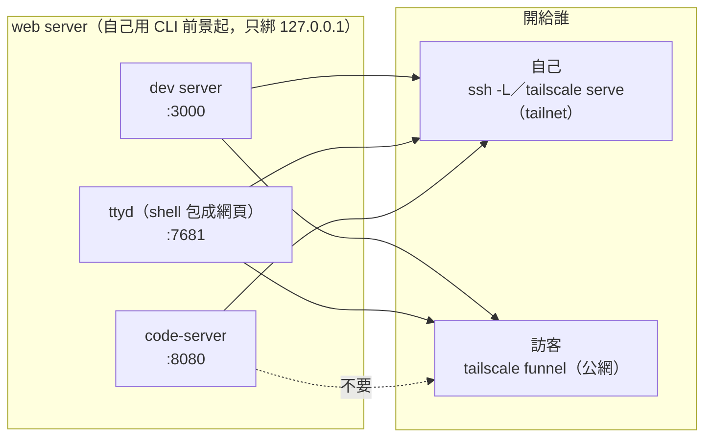
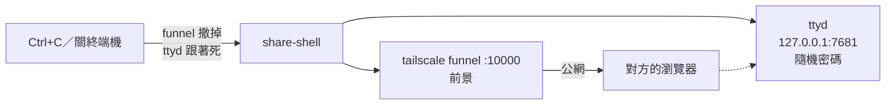

# 開給訪客看：tailscale funnel

對方沒有 ssh key、也沒有 tailscale，只有瀏覽器，想讓他看一下這台上的東西。
自己從別台裝置連進來是另一回事，見 [code-server-remote.md](code-server-remote.md)。

## 兩層分開想

要給人看的東西都是 **web server**，只綁在本機；「開給誰」是另外一層：



| server | 誰擋陌生人 | 能開給訪客嗎 |
|---|---|---|
| dev server | app 自己的登入 | 可以，對方看到的就是你的網站 |
| ttyd | **它自己沒有密碼**，`share-shell` 每次產一組 | 可以，用 `share-shell` |
| code-server | 自己的固定密碼 | **不要**：它能開 terminal，等於整台機器，只靠一組固定密碼 |

## 共通規則：funnel 不加 `--bg`

```
開：sudo tailscale funnel --https=10000 <port> ─► 印網址 ─► 停著（對方在用）
關：Ctrl+C／關終端機 ─────────────────────────► 撤掉，不留痕跡
```

- **不加 `--bg` 就是前景模式**：不寫進 `tailscale serve status` 的持久設定，行程結束就撤掉，
  也不會動到同一台已經在跑的其他 serve（company-ec2 的 code-server）。以前用 `--bg` 開，
  要記得手動 `off`；2026-10-02 發現 company-ec2 的公網 shell 開了 21 小時沒關。
- **Funnel 只能用 443、8443、10000。** company-ec2 的 443 給 code-server 的 tailnet serve 用了，
  所以用 10000。第一次開 Funnel 會給一個 admin console 連結開權限。
- **company-ec2 上要 sudo**（沒有 sudo 回 `Access denied`）。`tailscale set --operator=$USER`
  能免 sudo，但那是永久放寬，沒設。

## shell：`share-shell`

```bash
share-shell                                   # 開 login zsh
share-shell herdr session attach default      # 最後面接什麼，網頁就開什麼（tail -f 也行）
```

```
  https://company-ec2.tail9b4b9b.ts.net:10000
  帳號 guest  密碼 <每次隨機>
  (Ctrl+C 關閉，關了就失效)
```

整段複製給對方。用完 Ctrl+C，或直接關掉那個終端機。



script 在 [`home/dot_local/bin/executable_share-shell`](../home/dot_local/bin/executable_share-shell)。
它比另外兩種多做的只有一件：**幫 ttyd 產密碼**。

- **密碼每次隨機。** 這是公網上能打字的 shell（`-W`），擋在前面的只有這組密碼。固定密碼等於
  每個拿過的人永遠有效，貼在聊天室也收不回來。反正網址也要傳給對方，順便帶上密碼不多一步。
- **從 herdr 的 pane 裡跑也能 attach herdr。** ttyd 會繼承 `HERDR_ENV`，網頁裡再
  `herdr session attach` 會被當成巢狀擋掉（nested herdr is disabled）；script 起 ttyd 前先拿掉它。
- **要不要 sudo 自己判斷**：看 `tailscale debug prefs` 的 `OperatorUser`，是你就不加。

2026-10-02 在 company-ec2 實測收尾：

| 怎麼結束的 | funnel | ttyd |
|---|---|---|
| Ctrl+C（SIGINT） | 撤掉 | 被 trap 收掉 |
| 整個 process group 被 SIGKILL（例如 herdr 關 pane） | 撤掉，公網連過去 connection refused | 跟著死 |

## dev server：兩行，不用 script

兩個終端機，都不加 `--bg`，Ctrl+C 就收：

```bash
VITE_ALLOWED_HOSTS=<機器>.<tailnet>.ts.net pnpm dev      # 不設的話 Vite 回 Blocked request
sudo tailscale funnel --https=10000 <dev server 的 port>
```

- **port 看 dev server 啟動時印的那行。** teamsync-frontend 是 3000（`vite.config.js` 的
  `server.port`），而且 `strictPort: false`，3000 被佔了會往後跳。
- **`VITE_ALLOWED_HOSTS` 是 teamsync-frontend 的 `vite.config.js` 自己讀的**（逗號分隔），
  不是 Vite 內建的環境變數，別的專案不一定有。

## code-server：不開給訪客

code-server 本身就能開 terminal，給出去等於給整台機器；它的密碼又是固定的，給過就收不回。
真的要讓人看你的畫面，用 `share-shell` 開 shell 就好。
